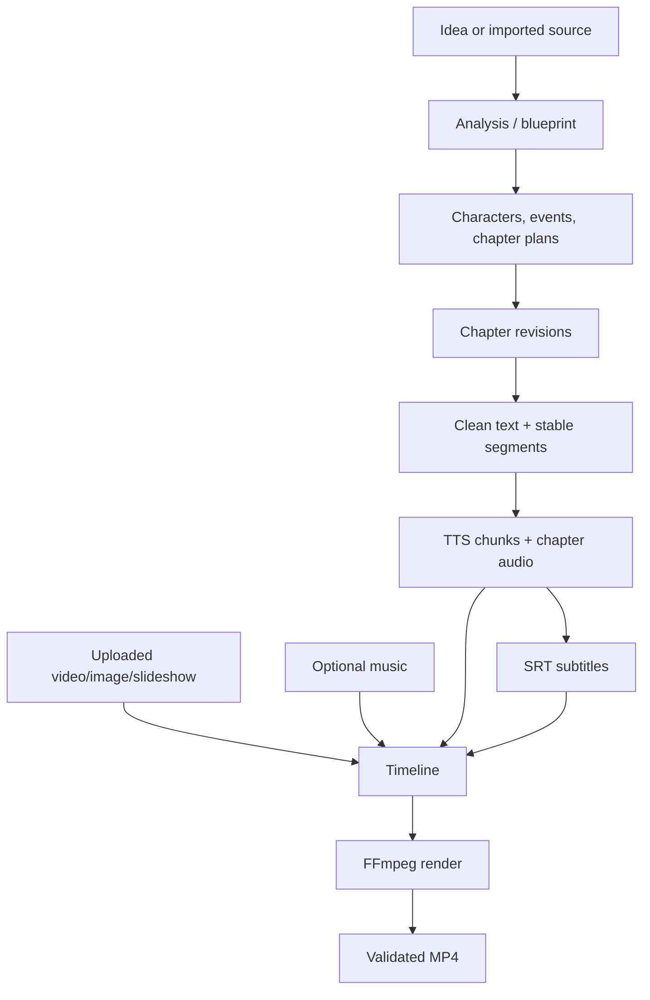

# V1 Product Scope

## Product promise

AI Story Studio turns an idea or an authorized user-provided story into a long-form narrated YouTube video while preserving review points and recoverable progress. “As little manual work as possible” means one pipeline command can complete defaults, not that the user loses control of chapter text, provider choice, costs, or retries.

## Primary user and constraints

- One creator on one workstation.
- Projects may contain tens or hundreds of chapters and hours of media.
- Local/free providers are preferred; cloud providers are opt-in.
- The application may be stopped during any long operation.
- The user is responsible for rights to imported text, voices, music, images, and video.

## V1 capabilities

### Project management

A `StoryProject` stores title, description, language, genre, target chapter count, creation mode, imported source reference, current blueprint revision, characters, chapter plans, chapter revisions, provider selections, TTS/visual/subtitle/render configuration, workflow state, and generated assets.

Project operations: create, edit metadata/configuration, archive, duplicate configuration, inspect storage, export final MP4, and delete only after an explicit destructive confirmation. Deleting a project is not part of workflow invalidation.

### Story creation modes

**Generate Story**

```text
idea + genre + language + approximate chapters + optional instructions
→ blueprint
→ characters and plot events
→ chapter plan
→ chapter generation
```

**Adapt User-Provided Story**

```text
authorized source
→ structural analysis
→ themes/arcs/roles/pacing extraction
→ transformation brief
→ new blueprint, setting, characters, causality and chapter plan
→ new chapters from the adaptation blueprint
```

Adaptation is not synonym replacement. Chapter prompts use the adaptation blueprint rather than the source prose. The UI states that the tool cannot guarantee non-infringement or originality; V1 has no legal/plagiarism oracle.

### Review and correction

- Review/edit blueprint, characters, plans, and chapters.
- Regenerate a selected chapter from its current plan.
- Freeze accepted chapter text; later operations use that revision.
- Generate/play/retry chapter audio.
- Inspect/download subtitles.
- Select background visual and optional music.
- Preview configuration and render final MP4.
- See current, stale, failed, running, and pending outputs with causes.

### Automation

“Run remaining” schedules only missing/invalidated descendants. It never silently overwrites a user-edited current chapter. A user can cancel queued/running work, change a provider for future work, retry a failed unit, or deliberately regenerate selected outputs.

## Required V1 pipeline



## Explicit non-goals

- Multi-user accounts, collaboration, cloud hosting, mobile apps.
- Automatic YouTube upload, channel analytics, thumbnails as a required path.
- AI image generation, character-consistent imagery, animation, image-to-video, AI video.
- Voice training/management UI; only provider configuration and voice selection.
- Full novel memory, embeddings/vector search, knowledge graphs, scene/shot planner.
- Dubbing/translation workflow, although provider interfaces leave room for them.
- Distributed workers, Redis/RabbitMQ, Kubernetes, event sourcing, plugin marketplace.
- Guaranteed byte-identical AI outputs or legal originality certification.

## Product success criteria

1. A project can reach a validated MP4 from either creation mode.
2. Restart loses no committed step, asset, progress, or error state.
3. A failed TTS chunk retries without repeating successful unchanged chunks.
4. A chapter edit invalidates exactly its audio, subtitle, and render descendants.
5. Chapter generation uses a recorded bounded context rather than all prior prose.
6. Provider choice is visible, changeable, and absent from workflow definitions.
7. A three-hour render shows progress, accepts cancellation, and never publishes a partial file as final.

## Decisions

### Decision: editable automation, not a black box
- **Alternatives:** one-click opaque pipeline; manual editor only.
- **Why:** long stories need correction, while repeatable defaults remove assembly work.
- **Trade-offs:** more states and UI than a linear script.
- **Future impact:** the same review gates can host quality evaluation and automatic regeneration.

### Decision: imported-story transformation is structurally mediated
- **Alternatives:** direct chapter-by-chapter rewrite; refuse imports entirely.
- **Why:** a transformation brief encourages materially new expression and supports long-context limits.
- **Trade-offs:** structural similarities and rights risks remain; an extra analysis stage costs tokens.
- **Future impact:** later originality/quality evaluators can compare analysis, blueprint, and output without making source prose the generation memory.
