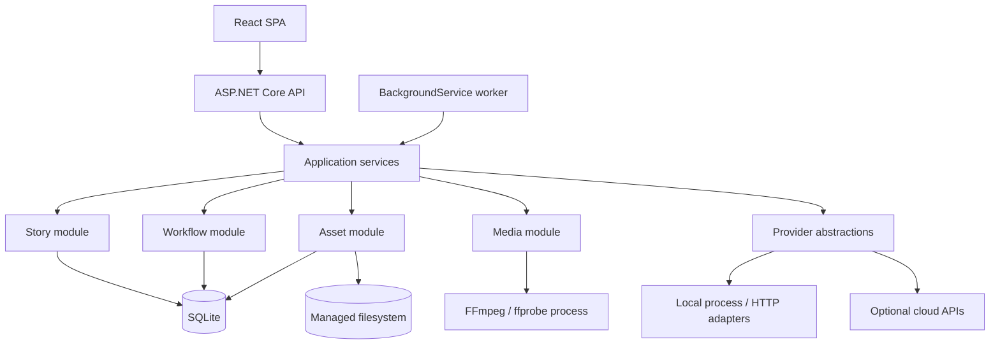

# System Architecture

## Architectural style

A modular monolith with two run modes from one .NET solution:

- **Web host:** ASP.NET Core API and static React application.
- **Worker host:** the same application modules hosted by one or more `.NET BackgroundService` instances. V1 may run web and worker in one process; a command-line switch can run a separate worker process against the same workspace if FFmpeg/model isolation is needed.

This is not a microservice split. There is one database, one filesystem authority, one deployment, and in-process application contracts.



## Modules and ownership

| Module | Owns | Does not own |
|---|---|---|
| Projects | project metadata and current configuration revisions | files, job execution |
| Story | blueprints, characters, events, plans, chapters, context compiler | provider SDKs, media |
| Workflow | definitions, executions, steps, dependencies, attempts, invalidation | story semantics, provider-specific retry |
| Providers | normalized contracts, registrations, capability/health metadata, config resolution | workflow scheduling |
| Assets | immutable asset records, paths, hashes, lineage, current-role pointers, reconciliation | creative generation |
| Audio | cleaning, segment/chunk manifests, merge plans | specific TTS protocols |
| Subtitles | cue model, segment timing, SRT serialization | ASR model internals |
| Visuals | background/slideshow specifications; future scenes | FFmpeg process control |
| Rendering | timeline, FFmpeg compilation, progress, validation | story generation |
| Persistence | EF Core mappings, transactions, query implementations | domain policy |

Modules reference IDs and application contracts. Domain types do not reference EF entities, HTTP DTOs, Python classes, or FFmpeg arguments.

## Request and work paths

### Interactive command

1. API validates request and optimistic concurrency token.
2. Application service changes one aggregate in a short SQLite transaction.
3. It computes direct semantic changes and invokes the workflow invalidator in the same transaction.
4. It returns current revisions and status projection.

### Long-running command

1. API creates/reuses a `WorkflowExecution` and materializes missing steps/dependencies.
2. A step row becomes claimable only after all required dependencies are completed/current.
3. Worker leases a step, records an attempt, and executes outside the database transaction.
4. Output is written to staging, hashed/probed, and then committed as an asset plus completed step in a short transaction.
5. Events update UI progress through polling first; SignalR is optional after the core path works.

## Data boundaries

- **SQLite:** authoritative metadata, revisions, statuses, dependency graph, attempts, progress, configuration snapshots, asset lineage.
- **Filesystem:** source text exports and large text/audio/image/video assets. No absolute user path becomes a trusted asset path; imported files are copied into the managed workspace.
- **Secrets:** references in provider configuration; secret values in an OS-protected store, never project exports/logs.
- **Temporary files:** per-attempt staging directory. A successful transaction promotes a file into its content/version path. Startup reconciliation deletes old unreferenced staging data after a grace period.

Proposed layout:

```text
workspace/
  studio.db
  projects/{projectId}/
    source/
    story/
    audio/{chapterId}/{revision}/segments/
    subtitles/{chapterId}/{revision}/
    visuals/
    renders/{renderJobId}/
  staging/{attemptId}/
  logs/{date}/
```

Database paths are workspace-relative and normalized; never store machine-specific absolute paths as asset identity.

## Cross-cutting policies

- UTC timestamps; monotonic progress inside one attempt.
- Optimistic concurrency on user-editable records.
- Structured logs with project/execution/step/attempt/provider correlation IDs and secret redaction.
- Cancellation tokens passed through .NET code; external process trees terminated on cancellation.
- Input fingerprint at every generated step.
- Provider/config snapshots retained on attempts and assets.
- Content written before a database reference; incomplete files never become current.

## Evolution seams

`VisualPlan` grows from one background to scenes; scenes gain generated images; timeline clips gain motion/video assets. `GenerationContext` gains world/character memory retrieval. Provider contracts gain image/video implementations. These are module additions and new workflow step types, not service extractions.

## Decision: one solution, optional two processes

- **Alternatives:** all work in web request; separate microservices and broker; desktop-only executable.
- **Why:** one codebase/DB keeps V1 simple, while a worker process isolates long jobs and can be restarted independently.
- **Trade-offs:** SQLite and filesystem prevent safe multi-machine scale; process coordination needs leases.
- **Future impact:** a remote worker transport can replace the claim repository later without rewriting story/media modules.
