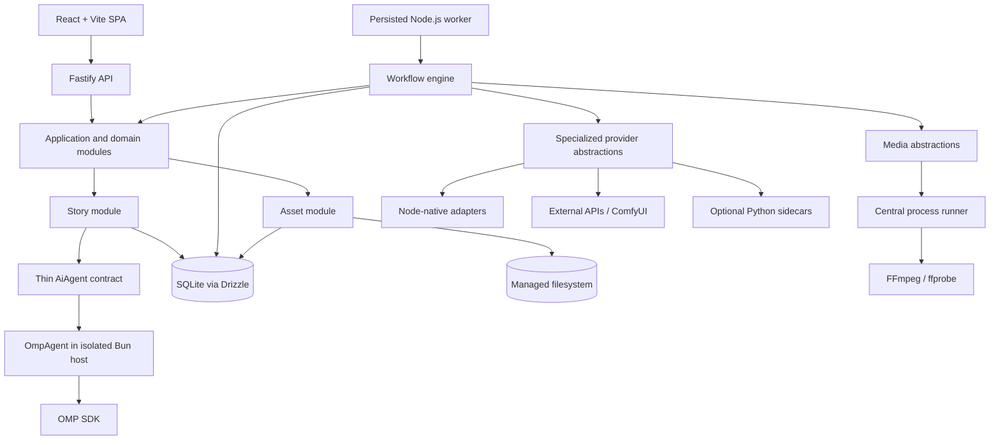

# System Architecture

## Architectural style

A TypeScript-first modular monolith in one pnpm workspace with three primary application run modes:

- **Web application:** React + TypeScript built by Vite.
- **API application:** Fastify composition root exposing thin HTTP routes.
- **Worker application:** a separately runnable Node.js process using the same application, workflow, database, provider, and media modules as the API.
- **OMP agent host:** an optional isolated Bun process, added only when an intelligent feature enters scope, that runs `OmpAgent` and OMP SDK without owning durable application state.

V1 may start the three primary applications with one development command, but the API and worker remain separate processes. The optional OMP host is an integration runtime, not a service boundary. There is one repository, one SQLite database, one managed filesystem authority, one local deployment, and direct TypeScript contracts. Keeping the worker separate prevents long FFmpeg or future model work from blocking API lifecycle and lets it restart independently.



## pnpm workspace boundaries

Start with the fewest packages that enforce a real dependency or reuse boundary:

```text
apps/
  web/                         React + Vite browser application
  api/                         Fastify HTTP composition root
  worker/                      persisted workflow worker entry point
  omp-agent/                   optional Bun-hosted OMP SDK adapter

packages/
  domain/                      domain rules and provider-neutral value types
  database/                    Drizzle schema, migrations, repositories
  workflow/                    workflow state machine and execution services
  providers/                   specialized provider contracts plus thin AiAgent/OmpAgent boundary
  media/                       process runner, FFmpeg/ffprobe integration
  shared/                      stable boundary schemas and DTO types only
```

This is a target shape, not a requirement to create every package or the optional OMP host immediately. `domain`, `database`, and `workflow` have clear ownership. `providers` and `media` isolate volatile external dependencies. `shared` exists only when both browser and server consume stable Zod DTO schemas, enums, identifiers, workflow statuses, specialized provider identifiers, or safe OMP execution-configuration identifiers. Merge packages that remain thin or create circular dependencies; do not preserve package count for architectural purity.

Allowed dependency direction:

```text
apps/web -> shared
apps/api -> application/domain + database + workflow + providers + media + shared
apps/worker -> application/domain + database + workflow + providers + media
apps/omp-agent -> providers/OmpAgent + OMP SDK
workflow -> domain + AiAgent and specialized provider/media ports
database/providers/media -> domain or workflow-owned ports
domain -> no infrastructure or transport package
```

## Modules and ownership

| Module | Owns | Does not own |
|---|---|---|
| Projects | project metadata and current configuration revisions | files, job execution |
| Story | blueprints, characters, events, plans, chapters, context compiler, feature-owned Zod AI output schemas | OMP SDK types, provider SDKs, media |
| Workflow | definitions, executions, steps, dependencies, attempts, invalidation | story semantics, OMP/provider-specific retry internals |
| AI execution | thin `AiAgent` contract, `OmpAgent` translation, restricted OMP lifecycle and observability | workflow state, retries, project persistence, specialized media |
| Providers | normalized specialized TypeScript contracts, registrations, capability/health metadata, config resolution | LLM provider implementations, workflow scheduling |
| Assets | immutable asset records, paths, hashes, lineage, current-role pointers, reconciliation | creative generation |
| Audio | cleaning, segment/chunk manifests, merge plans | specific TTS protocols |
| Subtitles | cue model, segment timing, SRT serialization | ASR model internals |
| Visuals | background/slideshow specifications; future scenes | FFmpeg process control |
| Rendering | timeline, FFmpeg compilation, progress, validation | story generation |
| Database | Drizzle schema, migrations, transactions, query implementations | domain policy |
| Process execution | shell-free child process lifecycle, output capture, timeout, cancellation | workflow decisions, raw user commands |

Modules reference IDs and application contracts. Domain types do not reference OMP SDK types, Drizzle row types, Fastify request objects, HTTP DTOs, Python classes, or FFmpeg arguments.

## HTTP boundary

Fastify is appropriate for this local-first API because its small core, low overhead, plugin encapsulation, lifecycle hooks, schema-oriented validation/serialization, and structured logging fit a long-running local process without imposing a broad application framework.

Routes remain thin:

1. Validate transport data with Zod where runtime validation has value.
2. Resolve request context and optimistic concurrency tokens.
3. Call one application command or query.
4. Map the result to a transport DTO and consistent error response.

Routes do not contain domain decisions, workflow scheduling, database claiming, provider retries, asset promotion, or FFmpeg argument construction. Fastify is the composition and transport boundary, not the application layer.

## Request and work paths

### Interactive command

1. Fastify validates the request DTO and optimistic concurrency token.
2. An application service changes one aggregate in a short SQLite transaction.
3. It computes direct semantic changes and invokes the workflow invalidator in the same transaction.
4. It returns explicit DTOs with current revisions and status projections.

### Long-running command

1. The API creates or reuses a `WorkflowExecution` and materializes missing steps and dependencies in SQLite.
2. A step row becomes claimable only after all required dependencies are completed and current.
3. The Node.js worker atomically claims a step, records an attempt, commits, and executes outside the database transaction.
4. Output is written to attempt staging, hashed and probed, then committed as an asset plus completed step in a short transaction.
5. The UI reads persisted status through polling first; push transport may be added later, but never becomes the source of truth.

## Type sharing boundaries

Good browser/server sharing candidates:

- Zod API request and response schemas;
- DTO types inferred from those schemas;
- stable IDs and enums;
- workflow status and progress vocabulary;
- provider kind and provider identifier;
- safe error codes and capability descriptors.

Do not share Drizzle schemas, database row types, repositories, aggregates, internal commands, provider SDK responses, secret-bearing configuration, or filesystem models with the browser. TypeScript enables deliberate contract sharing; it does not remove architectural boundaries.

## Data boundaries

- **SQLite:** authoritative metadata, revisions, statuses, dependency graph, attempts, progress, configuration snapshots, asset lineage.
- **Filesystem:** source text exports and large text/audio/image/video assets. No absolute user path becomes a trusted asset path; imported files are copied into the managed workspace.
- **Secrets:** references in provider configuration; secret values in an OS-protected store, never project exports or logs.
- **Temporary files:** per-attempt staging directory. A successful transaction promotes a file into its content/version path. Startup reconciliation deletes old unreferenced staging data after a grace period.

Proposed layout:

```text
workspace/
  studio.db
  projects/{projectId}/
    source/
    story/
    audio/{chapterId}/{revision}/segments/
    subtitles/{chapterId}/{revision}/
    visuals/
    renders/{renderJobId}/
  staging/{attemptId}/
  logs/{date}/
```

Database paths are workspace-relative and normalized; never store machine-specific absolute paths as asset identity.

## Centralized external process boundary

One process runner serves FFmpeg, ffprobe, an Edge TTS CLI when appropriate, and future one-shot Python tools. Its input is structured: executable path, argument array, working directory, allowlisted environment additions, timeout, bounded output policy, log context, and `AbortSignal`.

Required behavior:

- spawn the executable directly with arguments passed separately and shell mode disabled;
- never concatenate or evaluate an untrusted command string;
- capture stdout and stderr separately with bounded memory and optional attempt-log streaming;
- return exit code, terminating signal, duration, and safe diagnostic metadata;
- enforce timeout and `AbortSignal`;
- terminate the process tree gracefully, then force termination after a bounded grace period;
- emit structured, redacted logs correlated to project, execution, step, attempt, and provider.

Domain and workflow code request typed media/provider operations. Only media or provider adapters translate those requests into executable arguments.

## Cross-cutting policies

- UTC timestamps; monotonic progress inside one attempt.
- Optimistic concurrency on user-editable records.
- Structured logs with project/execution/step/attempt, specialized provider, and safe effective OMP model/provider correlation IDs plus secret/content redaction.
- `AbortSignal` propagates through application, OMP, specialized provider, HTTP, and process boundaries.
- Input fingerprint at every generated step.
- Specialized provider/config and OMP execution-configuration snapshots retained on attempts and assets.
- Content written before a database reference; incomplete files never become current.

## Evolution seams

`VisualPlan` grows from one background to scenes; scenes gain generated images; timeline clips gain motion/video assets. `GenerationContext` gains world/character memory retrieval. OMP-backed intelligent operations and specialized image/video provider contracts add new workflow step types without service extraction.

ComfyUI normally remains a separately managed service accessed through its API. Python may be introduced later as a versioned AI sidecar for model ecosystems such as F5-TTS, WhisperX, PyTorch, Transformers, or Diffusers. The current Bun-only OMP SDK runs in the optional isolated `OmpAgent` host. Node.js continues to own project state, workflow, retries, asset tracking, and orchestration.

## Decision: one workspace, three primary applications, optional OMP host

- **Alternatives:** all work in API requests; one Node.js process for API and worker; separate microservices and broker; Python-first backend; direct OMP SDK imports in Node.js feature code.
- **Why:** one TypeScript toolchain maximizes practical language, type, validation, and tooling reuse while independent API and worker processes isolate long jobs. The optional Bun host satisfies the current OMP SDK runtime without giving it a service-owned database or workflow.
- **Trade-offs:** package boundaries need discipline; API and worker coordinate through SQLite; the OMP integration adds a supervised runtime when intelligent features begin; process-tree handling requires platform-specific verification.
- **Future impact:** OMP can move in-process if it officially supports the approved runtime, and remote worker transport or specialized provider sidecars can replace adapters later, without rewriting story, workflow, or media contracts.

## Production application boundary

Prompt #14 adds `ProductionOrchestrator` and `PublicationPackageService` inside
the existing workflow/application module. The orchestrator persists
project-owned profiles, scoped runs, ordered stages, bounded stage work, and
interventions, but delegates canonical records and media to existing services.
`ADVANCE_PRODUCTION_RUN` is a coordination step on the same SQLite queue, not a
new scheduler.

The publication service creates revisioned metadata/manifests from current
Asset IDs, hashes, and measured durations. Safe export uses managed
workspace-relative paths and staging; no external publishing credentials or
platform API belong in the V1 boundary.
