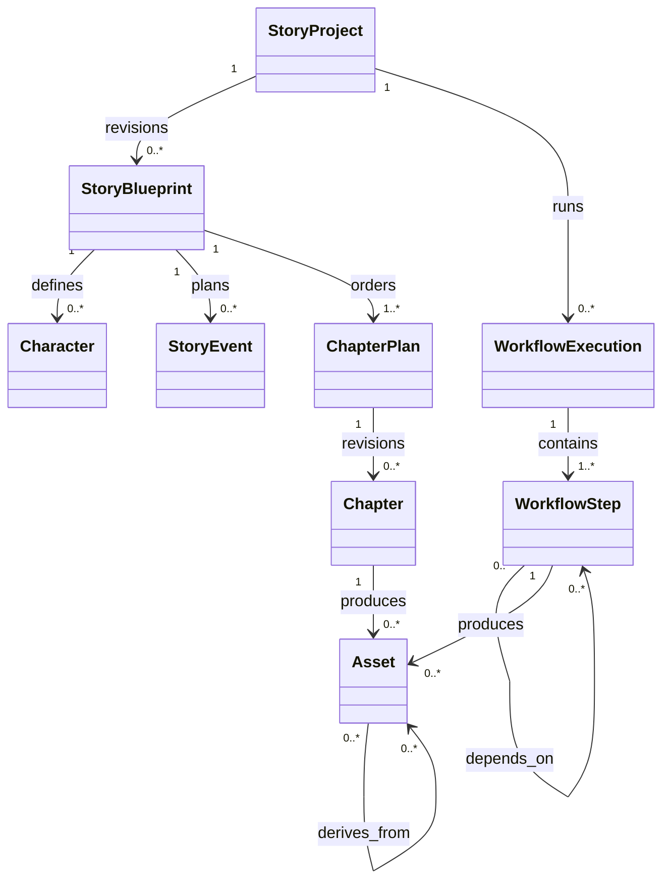

# Domain Model

## Aggregates

### StoryProject

Root for user intent and current selections.

- `Id`, `Title`, `Description`, `Language`, `Genre`, `TargetChapterCount`
- `CreationMode`: `Generate` or `Adapt`
- `SourceAssetId?`, `CurrentBlueprintId?`
- current `TtsConfig`, `VisualConfig`, `SubtitleConfig`, `RenderConfig` revision IDs
- `WorkflowSummary` projection, `CreatedAt`, `UpdatedAt`, concurrency token

Project configuration values are revisioned snapshots. Existing outputs retain the configuration revision used to create them.

### StoryBlueprint

Versioned global creative contract:

- premise/logline, themes, target audience, tone, language, genre/subgenre
- setting/world constraints, time period, point of view, tense, narrative style
- central conflict, stakes, act/arc outline, intended ending
- pacing and chapter-length guidance
- adaptation transformation brief and source-analysis reference when applicable
- `Revision`, `Status` (`Draft`, `Accepted`, `Superseded`), content hash

### Character

A versioned identity in one blueprint: name, role, archetype, goals, motivations, conflict, relationships, traits, voice notes, physical description (future visual use), first/last planned chapter, secrets and reveal constraints. Stable `CharacterId` survives revisions; `CharacterRevisionId` identifies content.

### StoryEvent

A continuity unit, not a full graph engine:

- event kind: setup, reveal, conflict, decision, consequence, relationship change, promise/payoff
- summary, participants, planned chapter range
- state: planned, introduced, active, resolved, abandoned
- introduced/resolved chapter IDs, importance, continuity notes
- predecessor IDs where explicit causality matters

V1 queries events by state, chapter range, and participant. It does not implement embeddings or inference over arbitrary prose.

### ChapterPlan

Ordered intent for one chapter: number, title, objective, opening state, beats, point-of-view character, participating character IDs, event IDs to introduce/advance/resolve, ending state/cliffhanger, target words, continuity constraints.

### Chapter

Versioned authored output:

- stable `ChapterId` and `ChapterPlanId`
- `Revision`, `Title`, `Body`, `Summary`, `WordCount`
- `Origin`: generated, adapted, user-edited
- `GenerationContextAssetId?`, `ProviderAttemptId?`
- event update proposals/accepted updates
- `IsUserEdited`, `IsCurrent`, timestamps, content hash/concurrency token

A save creates a revision; it does not mutate the text used by already completed outputs. The current pointer changes and descendants are invalidated.

### GenerationContext

An immutable input snapshot assembled for one generation attempt:

- blueprint revision and compact global summary
- current chapter plan revision
- selected character revisions with selection reasons
- selected prior chapter summaries with chapter/revision IDs
- unresolved/relevant event revisions
- optional writing instructions and negative constraints
- token/character budget, section allocation, builder version
- ordered content and final hash

It is stored as a JSON text asset for audit/retry but is not a general memory database.

## Media and orchestration types

- `TextSegment`: stable ordinal/ID, cleaned text, pause intent, language, character/voice hint, hash.
- `TtsChunk`: one provider-safe group of text segments and its input fingerprint.
- `SubtitleCue`: start/end, text, segment IDs, optional word timings/style role.
- `VisualPlan`: uploaded loop, still image, or slideshow plus fitting behavior.
- `Timeline`: video/audio/music/subtitle tracks with source assets and time ranges.
- `Asset`: immutable file/structured artifact metadata plus lineage.
- `WorkflowExecution`, `WorkflowStep`, `WorkflowStepAttempt`, `Dependency`: durable execution graph described in [04-workflow-engine.md](04-workflow-engine.md).

## Identity and revision rules

1. Stable IDs name concepts; revision IDs name immutable content.
2. Current pointers are explicit, never inferred from latest timestamps.
3. Generated outputs reference exact source revision IDs and hashes.
4. User edits never rewrite historical generation evidence.
5. Rich creative documents may be JSON-backed, but relations used for selection/invalidation are relational.

## Core invariants

- One accepted/current blueprint per project.
- One current chapter revision per stable chapter.
- Chapter numbers are unique within the current plan set.
- Completed steps have a committed output or an explicit no-output contract.
- Current generated assets have a fingerprint matching current direct inputs.
- An asset path is unique and confined to the workspace.
- Subtitle cue times are non-negative, ordered, and within audio duration tolerance.
- A final render references one immutable timeline manifest and exact assets.

## Decision: revisions instead of mutable blobs

- **Alternatives:** overwrite rows/files; snapshot the whole project after every edit; event sourcing.
- **Why:** per-entity revisions preserve reproducibility and enable precise invalidation without event-sourcing complexity.
- **Trade-offs:** more rows and explicit current pointers; retention policy is required.
- **Future impact:** world bibles, scenes, shots, and evaluator results can adopt the same stable-ID/revision pattern.
