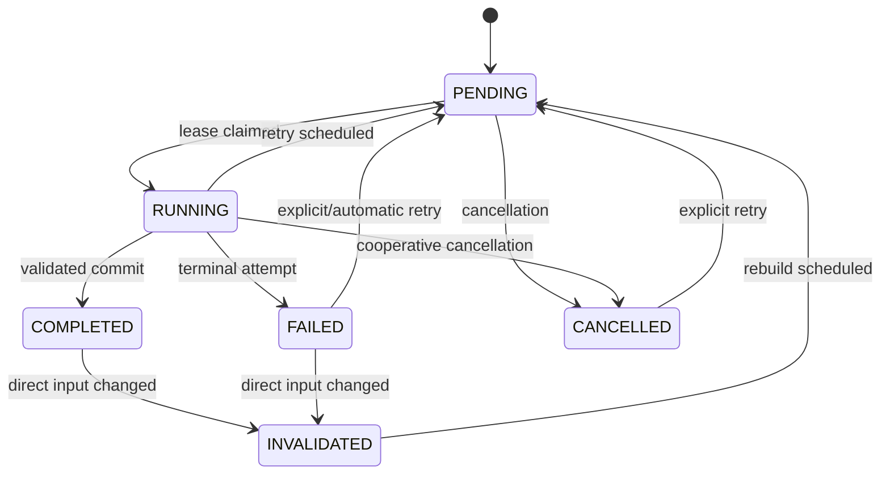

# Workflow Engine

## Model

- **Workflow:** versioned definition of step types, scopes, dependency rules, input selectors, retry policy, and executor key. Definitions are application-owned configuration, not arbitrary user scripts.
- **WorkflowExecution:** one persisted materialization for a project and purpose, with definition version, state, timestamps, cancellation request, and aggregate progress.
- **WorkflowStep:** durable work item scoped by a stable key such as `chapter.generate:chapter-027`, `tts.chunk:chapter-005/008`, or `render:final`. It stores status, input fingerprint, progress, lease, current attempt, and output references.
- **Dependency:** persisted edge from prerequisite step/asset revision to dependent step, with required/optional semantics.
- **WorkflowStepAttempt:** append-only execution evidence: attempt number, worker, provider/config snapshot, started/finished/heartbeat, checkpoint, error, logs, and usage.

`WorkflowStep` is also the V1 queue item. A second generic job queue would duplicate status and recovery semantics.

## Status state machine



Required statuses: `PENDING`, `RUNNING`, `COMPLETED`, `FAILED`, `INVALIDATED`, `CANCELLED`. `BLOCKED` is derived when a pending step has an incomplete/failed dependency; it need not be a persisted status. Execution aggregate status is derived plus explicit cancellation.

## Step completion contract

A step completes only when:

1. execution result satisfies the step validator;
2. output files are in managed staging and hashes/probe metadata are known;
3. asset rows and lineage can be committed;
4. input fingerprint still matches current direct inputs; and
5. output asset/current pointer plus `COMPLETED` transition commit in one DB transaction.

If inputs changed during execution, keep the artifact as historical evidence if useful but mark the step `INVALIDATED`; never publish it as current.

## Input fingerprint and dependencies

Canonical fingerprint:

```text
SHA-256(
  stepTypeVersion
  + ordered direct input revision IDs/content hashes
  + canonical relevant configuration snapshot
  + provider ID/model/version/capability-affecting settings
  + prompt/cleaner/chunker/timeline compiler version
)
```

Only configuration fields that affect output belong in the fingerprint. Display names, credentials, and retry counts do not.

Persist dependencies at the smallest useful scope:

```text
chapter-5 revision
  → clean chapter-5
    → tts segments/chunks chapter-5
      → merge chapter-audio-5
        → subtitles-5
          → final timeline/render

background asset/config ───────────────→ final timeline/render
music asset/config ────────────────────→ final timeline/render
```

Subtitle may depend on chunk timing assets plus chapter audio. Final render depends on every selected current chapter audio/subtitle and visual/music input.

## Invalidation algorithm

Within the command transaction:

1. create the new source/config revision and move its current pointer;
2. find completed/failed/cancelled steps whose direct input selector now resolves to a different fingerprint;
3. mark them `INVALIDATED`, clear current output-role pointers, retain historical assets;
4. traverse persisted outgoing dependency edges breadth-first and invalidate descendants;
5. leave unrelated nodes untouched;
6. append an invalidation event recording changed revision and affected step IDs.

Example chapter 5 edit: invalidate cleaning/TTS chunks/merge/subtitle for chapter 5, timeline and final render. Keep analysis, blueprint, chapters 1-4, chapters 6+, and their audio/subtitles current. Later story continuity is a warning, not an automatic dependency in V1.

## Retry

Retry policy belongs to the executor/provider category:

- transient network/429/5xx: bounded exponential backoff with jitter and provider `Retry-After`;
- local resource busy/out-of-memory: limited retry after resource release, then fail with actionable details;
- invalid request/schema/content: no blind retry; repair path or user change required;
- external process crash: retry from the last valid checkpoint if executor supports it;
- cancellation: never automatic retry.

An explicit retry creates a new attempt. Successful existing child units (for example TTS chunks) are reused when fingerprints match.

## Checkpoints

Checkpoint is small executor-owned JSON stored on the attempt, plus committed child assets/steps. It may record last planned batch, FFmpeg pass, downloaded provider job ID, or merge input ordinal. Never put large media in checkpoint JSON. A checkpoint has a schema version and is valid only for the same fingerprint/executor version.

## Errors and logs

Normalized error fields: category, stable code, safe user message, technical detail, provider HTTP/status code, retryability, failed input unit, exception type/stack, stderr/log asset, occurred time, correlation IDs. Secrets and full imported prose are redacted from routine logs.

## Recovery after restart

Running steps have leases and heartbeats. On startup, an expired lease closes its attempt as `WorkerLost`; the step returns to `PENDING` if retry policy allows, otherwise `FAILED`. Completed steps are not rerun. Staging reconciliation checks uncommitted files separately.

## Decision: persisted dependency graph, not event sourcing

- **Alternatives:** fixed linear pipeline; event-sourced aggregate; external workflow platform.
- **Why:** explicit edges enable exact chapter/chunk invalidation and independent retry while remaining understandable in SQLite.
- **Trade-offs:** graph materialization and cycle validation add code; historical state is attempts/revisions rather than replayable events.
- **Future impact:** scene/image/video/evaluation nodes append naturally; a remote scheduler can later consume the same step contract.
