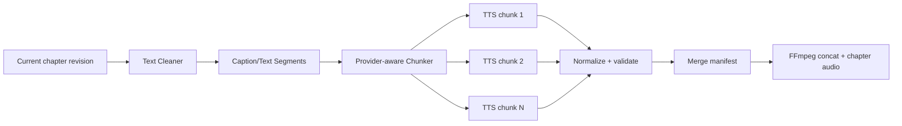

# TTS Pipeline

## Pipeline

Every box after segmentation produces a versioned manifest or asset. TTS chunks are child workflow steps and independently retryable.

## Text cleaner

The cleaner is deterministic, language-aware, versioned, and conservative:

- normalize Unicode and line endings;
- remove control/zero-width characters and unsupported markup;
- translate formatting with spoken meaning through explicit rules (for example chapter headings optional, URLs/numbers configurable);
- preserve sentence punctuation and paragraph boundaries;
- collapse accidental whitespace without joining words;
- represent intended pauses as structured break hints rather than provider-specific SSML;
- emit warnings for removed/replaced characters.

Keep original chapter text, cleaned text, and a change report. Do not ask an LLM to “clean” narration by default; semantic changes belong in chapter editing.

## Segmentation and chunking

First split into stable human caption segments, then pack them into provider requests. Stable segment ID derives from chapter revision + ordinal + text hash. Boundary preference: paragraph, sentence, clause, then safe word/grapheme boundary. Never split a Unicode grapheme or UTF-8 sequence.

Provider limits may include characters, UTF-8 bytes, estimated tokens, SSML bytes, or expected duration. The chunker uses the most restrictive configured limit and reserves envelope overhead. A single oversized sentence is split at punctuation/word boundaries with a warning.

Packing rules:

- preserve order and segment boundaries;
- include language/voice and pause metadata;
- no unlimited text requests;
- deterministic output for same cleaner/chunker version, limits, and text;
- hash every chunk request independently.

## Chunk synthesis

A `TtsChunk` step inputs exact segment text, voice/model/config, provider limit/version, cleaner/chunker versions. The adapter may return audio and word/sentence boundaries. Normalize every successful chunk to one intermediate format: PCM WAV, mono, 48 kHz, 16-bit for V1. This costs disk but avoids codec delay/format mismatches during long merges; cleanup remains explicit.

Validate with ffprobe/audio parser:

- decodable, non-empty, expected channels/sample rate after normalization;
- finite duration within broad text-rate bounds;
- no clipping/silence anomaly when inexpensive checks are available;
- boundary offsets monotonic and within duration.

A provider result failing validation is a failed attempt, not completed output.

## Retry and idempotency

Transient provider errors retry per chunk with bounded policy. Completed chunks with matching fingerprints are reused. Changing one segment rechunks only the affected region if stable packing can preserve later chunk boundaries; V1 may conservatively invalidate all chunks for that chapter after the changed boundary, never other chapters.

Remote providers receive an attempt/idempotency key when supported. Since TTS may be nondeterministic, a manual retry creates a new asset and attempt; it does not overwrite the old file.

## Audio merge

Build an ordered merge manifest containing each chunk asset/hash, exact measured duration, inter-chunk pause, normalization spec, and total expected duration. FFmpeg concatenates normalized streams and inserts configured silence. Validate the merged chapter audio duration against sum of segments within a small encoder/probe tolerance.

Chapter audio remains WAV for editing/reuse. Final video render encodes narration to AAC once. If storage becomes a problem, a future lossless FLAC intermediate can replace WAV behind the same media contract.

## Provider limits and resources

- Worker concurrency uses provider descriptor limits and resource class (`Network`, `CPU`, `GPU`).
- Rate limits are shared per provider configuration, not independently ignored by 100 chapter jobs.
- Model-loading providers are long-lived sidecars with a single/few GPU lanes.
- Cost estimate and actual usage are aggregated from chunk attempts.

## Decision: segment-first synthesis

- **Alternatives:** whole chapter call; sentence-per-call only; post-hoc ASR determines all structure.
- **Why:** semantic segments create retry, progress, subtitle, and provider-limit units while packing reduces call overhead.
- **Trade-offs:** joins can sound unnatural; deterministic pause/crossfade policy needs tuning; more artifacts.
- **Future impact:** character voices, dialogue-level TTS, emotion tags, and word timing extend segment metadata without replacing the pipeline.
