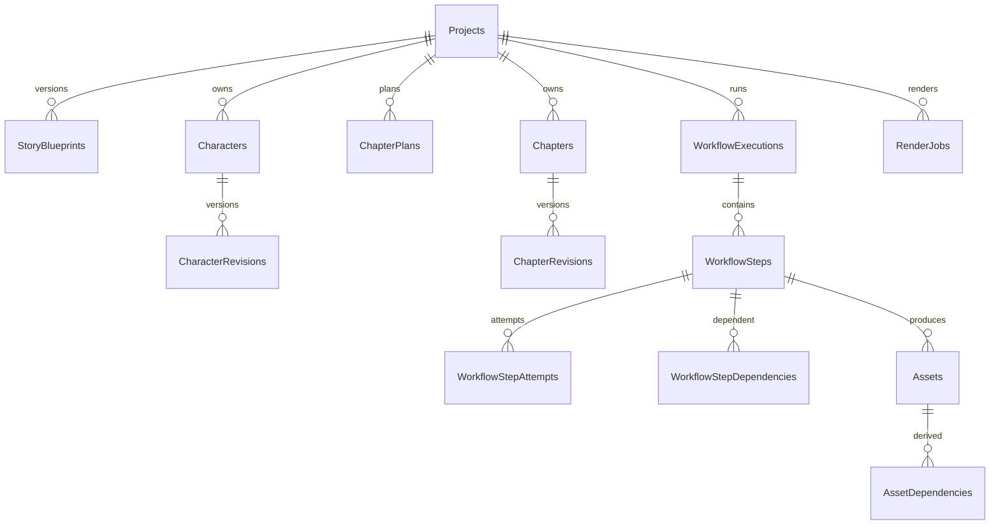

# Database Design

## Recommendation

Use SQLite with Drizzle ORM for V1. One workstation, one local worker, large blobs outside the database, and short transactions fit SQLite well. Enable foreign keys, WAL journal mode, a busy timeout, and coordinated checkpoint/backup behavior. Do not introduce PostgreSQL, Redis, or a broker until multi-machine/multi-user write concurrency or measured SQLite contention demonstrates a real need.

## Conventions

- IDs: application-generated UUIDv7 values stored as canonical lowercase TEXT for simple SQLite inspection and time-ordered indexes; external/provider request IDs remain separate strings.
- Timestamps: UTC ISO-8601 TEXT or integer epoch milliseconds, chosen once and used consistently; durations use integer milliseconds.
- Enums: readable TEXT constrained by application validation and database `CHECK` constraints where practical.
- Optimistic concurrency: integer `row_version` incremented in the same conditional update that changes the row.
- Rich structured creative/configuration content: versioned canonical JSON plus promoted relational columns or links needed for querying.
- Soft lifecycle for projects/assets; immutable revisions/attempts are not updated except controlled status, progress, heartbeat, and outcome fields.

## Drizzle schema and migrations

Drizzle schema declarations are the typed source for tables, columns, relations, indexes, and constraints. Generated SQL migration files are ordered, reviewed artifacts. Applied migration identity is recorded in SQLite; deployed databases are never synchronized by destructive schema push.

Migration policy:

- run migrations through one explicit CLI/startup coordination path before API and worker accept work;
- never let API and worker independently race to migrate the same database;
- acquire an application-level migration lock and use SQLite's transactional DDL where supported;
- back up before a migration that rebuilds or transforms large tables;
- make data backfills explicit and restart-aware rather than hiding them in ordinary request startup;
- fail startup with a clear schema-version error instead of operating against a partial migration.

No migrations are created in this design phase.

## Connection and transaction policy

Every connection sets `PRAGMA foreign_keys = ON` and a configured `busy_timeout`. Workspace initialization sets `journal_mode = WAL`; the application verifies the effective mode rather than assuming the pragma succeeded. `synchronous = NORMAL` is a reasonable WAL default for the local application, subject to explicit durability testing and documentation.

The API and worker may hold separate connection pools, but pool sizes stay small. SQLite still has one writer at a time; a large pool does not create write parallelism. All write transactions are short and contain only database work:

- aggregate update plus dependency invalidation;
- step claim plus attempt creation;
- heartbeat/progress checkpoint;
- asset metadata plus successful step completion;
- cancellation or failure transition.

Provider calls, FFmpeg, hashing, probing, filesystem copies, and waits never occur inside a database transaction. Use Drizzle transactions for ordinary operations. Parameterized raw SQL is permitted only behind a focused repository when SQLite-specific claim or migration semantics are clearer and safer than the query builder.

## Index policy

Create indexes from concrete access paths, not for every foreign key or JSON field:

- project/revision and current-pointer lookups;
- unique stable ordering such as project plus chapter number;
- workflow dependency joins;
- due-step claiming by status, next-attempt time, priority, and creation time;
- expired-lease recovery;
- project/type/role/current asset lookup;
- unique asset path and useful content-hash lookup.

Verify critical claim and status queries with `EXPLAIN QUERY PLAN` when implementation begins. Promote JSON fields to columns only when filtering or uniqueness requires it.

## Safe job claiming

One local worker is the initial assumption, but claiming remains atomic so a future second process cannot normally execute the same step.

In one short `BEGIN IMMEDIATE` transaction:

1. Select one due `PENDING` step whose required dependencies are completed/current and whose cancellation flag is clear.
2. Order by priority, next-attempt time, and creation time using the claim index.
3. Conditionally update that exact step from `PENDING` to `RUNNING`, setting lease owner, lease expiry, current attempt ID, and incremented attempt count.
4. Insert the append-only attempt row.
5. Commit before executing provider or media work.

The worker proceeds only when the conditional update affects exactly one row. If it affects zero, the claim lost a race or became ineligible; roll back and retry later. Completion and heartbeat updates also require the expected running status, attempt ID, and lease owner so a stale worker cannot overwrite a recovered attempt.

SQLite does not provide `SELECT ... FOR UPDATE` or skip-locked queue semantics. `BEGIN IMMEDIATE` obtains the write reservation before selection, and the conditional update remains the correctness guard. Keep the claim transaction bounded to one step; do not reserve a batch that may sit idle.

## Proposed tables

### Project/story

| Table | Important columns | Relationships/constraints |
|---|---|---|
| `Projects` | `Id`, title, description, language, genre, target chapter count, creation mode, source asset ID, current blueprint ID, current config revision IDs, created/updated, row version, archived at | source/current FKs nullable; title not globally unique |
| `StoryBlueprints` | `Id`, project ID, revision, status, content JSON, hash, source analysis asset ID, created at | unique `(ProjectId, Revision)`; one current/accepted enforced by transaction/filtered strategy |
| `Characters` | `Id` stable character ID, project ID | stable identity |
| `CharacterRevisions` | `Id`, character ID, blueprint ID, revision, name/role, content JSON, hash | unique `(CharacterId, Revision)` |
| `StoryEvents` | `Id` stable event ID, project ID | stable identity |
| `StoryEventRevisions` | `Id`, event ID, blueprint ID, revision, kind/state/importance, chapter range, content JSON, hash | indexes by blueprint/state/range |
| `StoryEventCharacters` | event revision ID, character ID | composite PK |
| `StoryEventLinks` | from event revision, to event ID, link type | no self-link; causal subset only |
| `ChapterPlans` | `Id`, project ID, blueprint ID, chapter number, revision, title, objective, content JSON, hash, current | unique current chapter number per project/plan set |
| `ChapterPlanCharacters` | plan ID, character ID, role | composite PK |
| `ChapterPlanEvents` | plan ID, event ID, intended action | composite PK |
| `Chapters` | `Id` stable chapter ID, project ID, chapter number | unique `(ProjectId, ChapterNumber)` for V1 stable plan |
| `ChapterRevisions` | `Id`, chapter ID, plan ID, revision, title, body/text asset ID, summary, word count, origin, context asset ID, provider attempt ID, hash, user-edited/current, created at, row version | unique `(ChapterId, Revision)`; one current |

If chapter bodies are stored as files, `Body` may be omitted after early implementation; source-of-truth policy must be singular. Recommendation: relational text for current/editable chapter bodies plus immutable exported `ChapterText` asset on workflow boundary. Large imported sources remain files/assets.

### Config/providers

| Table | Important columns | Notes |
|---|---|---|
| `ProjectConfigRevisions` | `Id`, project ID, kind (`TTS`,`Visual`,`Subtitle`,`Render`), revision, canonical JSON, hash, created at | one current pointer held by project |
| `ProviderConfigurations` | `Id`, kind, provider ID, name, cost tier, enabled, non-secret JSON, secret reference, created/updated, row version | global/local user settings; never plaintext secret |
| `ProviderHealthChecks` | provider config ID, checked at, status, latency, safe message, discovered version/capabilities JSON | bounded history or latest only |

### Workflow/jobs

| Table | Important columns | Notes |
|---|---|---|
| `WorkflowExecutions` | `Id`, project ID, workflow key/version, status, requested/cancelled timestamps, progress totals, created/finished | container |
| `WorkflowSteps` | `Id`, execution ID, step key/type/version, scope kind/ID, status, priority, input fingerprint, progress current/total/message, attempt count/max, next attempt at, cancellation requested, lease owner/expires, current attempt ID, output summary, created/updated | unique `(ExecutionId, StepKey)`; claim indexes |
| `WorkflowStepDependencies` | step ID, depends-on step ID, kind | composite PK; cycle checked on materialization |
| `WorkflowStepAttempts` | `Id`, step ID, attempt number, worker ID, status/outcome, provider config snapshot, start/heartbeat/end, checkpoint JSON/version, error category/code/message/detail, log asset ID, usage/cost JSON | unique `(StepId, AttemptNumber)`; append-only evidence |
| `WorkflowEvents` | `Id`, execution/step/attempt IDs, sequence, kind, payload JSON, created at | UI/audit events, not event sourcing |

Claim query index: `(Status, NextAttemptAt, Priority, CreatedAt)` plus `(LeaseExpiresAt)` and dependency lookup indexes. The worker atomically claims one candidate per short transaction; no transaction spans execution.

### Assets/media

| Table | Important columns | Notes |
|---|---|---|
| `Assets` | `Id`, project ID, type, role, status, relative path, media type, bytes, SHA-256, version, source step/attempt, provider/config snapshot, input fingerprint, producer/version, metadata JSON, current, validation error, retention, created/deleted | unique path; indexes project/type/role/current/hash |
| `AssetDependencies` | asset ID, dependency asset ID, role, recorded source hash | composite PK; lineage |
| `AssetRoleCurrent` | project ID, logical role key, asset ID, updated at | unique role pointer; preferable to fragile partial unique booleans |
| `RenderJobs` | `Id`, project ID, workflow step ID, timeline asset ID, render config revision ID, output asset ID, expected/actual duration, ffmpeg version, status projection, created/started/finished | one-to-one with render step where applicable |

TTS segment/chunk manifests and subtitle structured cues can initially be immutable JSON assets; promote them to relational tables only when UI editing/query needs it. Avoid mirroring every JSON field prematurely.

## Relationships

## Backup and integrity

A consistent backup coordinates SQLite's online backup API/checkpoint and the workspace files. First implementation can offer “close/idle then copy workspace” with verification. Startup runs `PRAGMA integrity_check` only when requested/recovery is suspected, and always performs lightweight schema/version plus current-asset existence checks.

## Decision: SQLite now, migration seam later

- **Alternatives:** PostgreSQL; document database; filesystem JSON only.
- **Why:** SQLite minimizes installation/operations and supports the transactional workflow metadata V1 needs.
- **Trade-offs:** one writer at a time, no native distributed claiming, migrations require care.
- **Future impact:** repository/application boundaries and provider-neutral IDs allow PostgreSQL migration if concurrent remote workers become real requirements.
