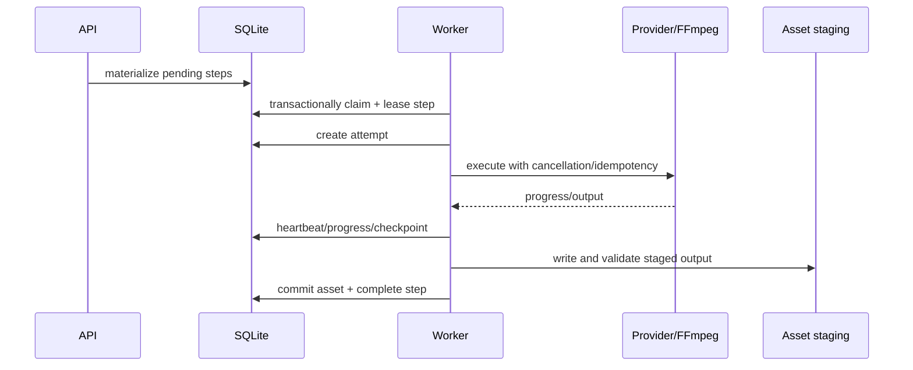

# Background Jobs

## V1 decision

A database-backed worker is enough. `WorkflowSteps` are both dependency nodes and queue work items; `.NET BackgroundService` claims them from SQLite. Do not add Redis/RabbitMQ or a separate job framework until multiple machines or high concurrent producers are required.

## Lifecycle

## Claiming and leases

In a short transaction, select a due `PENDING` step whose required dependencies are completed/current and whose resource lane is available. Conditional update sets `RUNNING`, `LeaseOwner`, `LeaseExpiresAt`, and attempt. If another worker changed the row, retry selection. Keep the transaction short; provider/media work runs outside it.

Worker heartbeat renews the lease and attempt timestamp. Lease duration exceeds normal heartbeat jitter but is far shorter than multi-hour execution. On startup/periodically, expired running steps close as `WorkerLost` and retry or fail per policy.

## Resource-aware concurrency

V1 has a small in-process scheduler:

- `Database/Control`: low cost, short;
- `Network`: configurable parallelism with per-provider limiter;
- `CPU`: limited by configured cores;
- `GPU`: normally one job/model lane on a consumer GPU;
- `FFmpeg`: one heavy render by default, possibly separate light probe lane.

A step declares resource class and provider configuration. Global and per-provider semaphores are execution guards, while the DB remains the truth. Leases prevent duplicate claims across optional web/worker processes.

## Batch generation

“Generate 100 chapters” materializes chapter steps plus dependencies. It does not create one opaque 100-chapter job. Scheduling policy can keep chapter generation sequential where continuity requires prior summary, while TTS for completed chapters proceeds concurrently within provider/resource limits. Backpressure limits how far downstream work expands and disk use.

Suggested dependencies:

- chapter N generation depends on accepted summary/event update of N-1 unless chapters are manually pre-generated;
- TTS N depends only on current chapter N/cleaning;
- subtitle N depends on audio/timing N;
- render depends on all selected chapters/subtitles/background.

## Progress

Each step exposes `Current`, `Total`, `Unit`, and safe message. Aggregate progress is weighted by known work units, not naive step count: chapters, TTS chunks, audio duration, or FFmpeg output time. Show stage-specific fractions (`35/50`) because a single percent hides actionable detail. Progress is monotonic within an attempt and may reset on a new attempt.

## Retry

- Automatic only for classified transient errors within `MaxAttempts` and backoff.
- Manual retry always records a new attempt; user may change provider/config first.
- Reuse matching completed child steps/assets.
- Provider remote job ID is checkpointed so polling resumes instead of submitting a duplicate where supported.
- Attempt logs/errors remain after success for diagnosis.

## Cancellation

`CancellationRequestedAt` is durable. Workers check before claim, before/after provider calls, between chunks, and while reading progress. HTTP calls receive cancellation tokens. External process trees get graceful termination then forced kill. Remote paid jobs are cancelled when the adapter supports it; otherwise UI warns that provider billing may continue. Partial outputs never become current assets.

Cancellation results in `CANCELLED`, not `FAILED`. “Resume” is an explicit new attempt from valid checkpoints/children.

## Error logs and observability

- Structured application logs: IDs, step type, timing, provider, resource, outcome.
- User-safe error on step; technical detail and bounded stderr/raw response as protected log asset.
- Rolling local log files with retention.
- Event feed for UI: queued, started, progress, retry scheduled, completed, failed, invalidated, cancelled.
- No source story bodies, chapter bodies, API keys, or signed URLs in routine logs.

## Restart scenarios

| Situation at shutdown | Recovery |
|---|---|
| pending | remains pending |
| completed | remains completed; validate current fingerprint before use |
| running, lease active because process restarts quickly | wait until lease expires or startup owns same worker identity safely; simplest V1 expires local worker leases on clean startup |
| running, lease expired | close attempt `WorkerLost`; retry/fail |
| staged output, no DB asset | reconciliation quarantines/deletes after grace period |
| remote provider job checkpoint | adapter polls existing job |
| FFmpeg partial file | new attempt starts from timeline; delete/quarantine partial file |

## Decision: workflow-step queue

- **Alternatives:** Hangfire/Quartz; channel-only queue; Redis/RabbitMQ.
- **Why:** workflow already needs persisted fine-grained status/dependencies; using the same rows avoids conflicting job truth.
- **Trade-offs:** custom claim/recovery code must be well tested; SQLite constrains worker scale.
- **Future impact:** an outbox/remote queue can transport step IDs later while workflow state remains authoritative.
