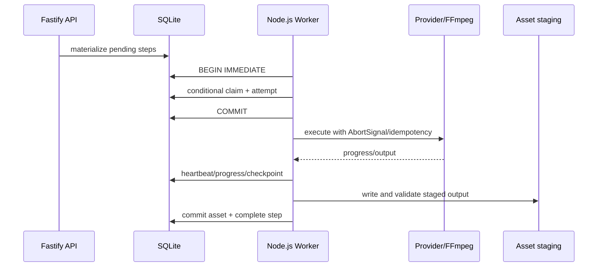

# Background Jobs

## V1 decision

A persisted Node.js worker is enough. `WorkflowSteps` are both dependency nodes and queue work items; SQLite is the source of truth. The Fastify API creates work in SQLite, and one separately runnable local worker claims and executes it.

Do not add Redis, BullMQ, RabbitMQ, Kafka, or a separate job framework until measured requirements need multiple machines, many concurrent producers, or queue semantics that SQLite cannot provide.

## Lifecycle

The API never executes long work in an HTTP handler. The worker never treats in-memory queue state as authoritative.

## Worker loop

The initial worker has one process identity and one execution loop:

1. Recover expired attempts and reconcile stale staging data.
2. Poll SQLite for one due, dependency-ready step.
3. Claim it atomically and create an attempt in the same transaction.
4. Execute outside the transaction with an attempt-scoped `AbortController`.
5. Persist heartbeats, monotonic progress, and restart checkpoints.
6. Commit a terminal outcome and validated assets conditionally against the active attempt.
7. Wait with bounded backoff when no step is claimable.

One worker does not imply one opaque job. A step is the smallest practical retry and invalidation unit. Internal resource concurrency may be added only after the vertical slice works and must remain bounded.

## Claiming and leases

In a short `BEGIN IMMEDIATE` transaction, select one due `PENDING` step whose cancellation flag is clear and required dependencies are completed/current. Use the claim index and deterministic priority ordering. A conditional update sets:

- status `RUNNING`;
- `LeaseOwner` to the worker identity;
- `LeaseExpiresAt`;
- incremented attempt count;
- `CurrentAttemptId`;
- updated timestamp.

Insert the append-only attempt row before commit. Execute the step only if the conditional update affected exactly one row. A zero-row update means the step changed or lost eligibility; roll back and retry later.

Provider, network, process, hashing, probing, and filesystem work all run after commit. Heartbeats renew the lease only when status, attempt ID, and lease owner still match. Completion uses the same ownership guard so a stale worker cannot overwrite a recovered attempt.

Lease duration exceeds normal heartbeat and event-loop jitter but is much shorter than a multi-hour operation. On startup and periodically, an expired running step closes its attempt as `WorkerLost`, then transitions to retry or terminal failure according to persisted policy.

## Duplicate-execution guarantees

Under the normal one-worker model, an atomic conditional claim prevents two executions of the same attempt. The design also preserves lease fields so an accidental second worker follows the same guard.

A process can crash after an external provider accepts work but before the checkpoint is persisted. No local queue can guarantee exactly-once behavior across that boundary. Reduce ambiguity with:

- stable attempt/idempotency keys supplied to providers that support them;
- persisted remote provider job IDs and polling checkpoints;
- attempt-scoped staging directories;
- input fingerprints and reuse of current matching outputs;
- conditional asset promotion and terminal updates;
- explicit `OutcomeUnknown` failure when blind retry could duplicate paid or non-idempotent work.

The guarantee is no duplicate execution under normal operation, not universal exactly-once side effects after arbitrary crashes.

## Resource-aware execution

Start with one active workflow step. When measured throughput justifies limited concurrency, use in-process semaphores by resource class:

- `Database/Control`: low cost and short;
- `Network`: configured parallelism with per-provider limiter;
- `CPU`: limited by configured cores;
- `GPU`: normally one job/model lane on a consumer GPU;
- `FFmpeg`: one heavy render by default, with an optional separate light probe lane.

Semaphores are execution guards, not job truth. SQLite statuses, leases, attempts, and checkpoints remain authoritative.

## Batch generation

“Generate 100 chapters” materializes chapter steps plus dependencies. It does not create one opaque 100-chapter job. Scheduling can keep chapter generation sequential where continuity requires the prior summary, while TTS for completed chapters proceeds within configured resource limits. Backpressure limits how far downstream work expands and controls disk use.

Suggested dependencies:

- chapter N generation depends on accepted summary/event update of N-1 unless chapters are manually pre-generated;
- TTS N depends only on current chapter N/cleaning;
- subtitle N depends on audio/timing N;
- render depends on all selected chapters/subtitles/background.

## Persisted progress and checkpoints

Each step exposes `Current`, `Total`, `Unit`, and a safe message. Aggregate progress is weighted by known work units, not naive step count: chapters, TTS chunks, audio duration, or FFmpeg output time. Show stage-specific fractions (`35/50`) because a single percent hides actionable detail. Progress is monotonic within an attempt and may reset for a new attempt.

Persist checkpoints only at restart-safe boundaries:

- completed TTS chunk IDs and their asset fingerprints;
- remote provider job ID and last known state;
- completed child-step IDs;
- validated input manifest and output staging references.

Do not persist transient in-memory objects, child process handles, or model instances.

## Retry and failure recovery

- Automatic retry applies only to classified transient errors within `MaxAttempts`, using persisted `NextAttemptAt` and bounded exponential backoff with jitter.
- Manual retry always records a new attempt; the user may change provider/config first.
- A new attempt reuses matching completed child steps and assets.
- A checkpointed remote job resumes polling instead of submitting a duplicate where supported.
- Attempt logs and errors remain after eventual success.
- Permanent input, authentication, content-policy, unsupported-capability, and deterministic media-validation errors fail visibly without automatic retry.
- Worker loss follows the same persisted attempt policy rather than an in-memory retry counter.

## Cancellation

`CancellationRequestedAt` is durable. The API only records the request; the worker observes it:

- before claim;
- before and after provider calls;
- between chunks;
- during heartbeat/progress handling;
- while an external process is active.

An active attempt owns an `AbortController`. Its signal propagates to Node HTTP clients, provider adapters, and the centralized process runner. External process trees receive graceful termination and then forced termination after a bounded grace period. Remote paid jobs are cancelled when the adapter supports it; otherwise the UI warns that provider work or billing may continue.

Cancellation commits `CANCELLED`, not `FAILED`. Partial outputs stay in attempt staging and never become current assets. “Resume” creates an explicit new attempt from valid checkpoints or completed children.

## External process execution

FFmpeg, ffprobe, appropriate CLIs, and future Python subprocesses run only through the centralized process abstraction. It passes executable arguments separately with shell mode disabled, captures stdout/stderr separately, enforces output limits and timeouts, returns exit code/signal/duration, accepts `AbortSignal`, terminates the process tree, and writes redacted structured logs.

Never execute untrusted strings through a shell. Workflow step payloads contain typed settings and managed asset references, not command text.

## Error logs and observability

- Structured application logs: IDs, step type, timing, provider, resource, outcome.
- User-safe error on the step; technical detail and bounded stderr/raw response as a protected log asset.
- Rolling local log files with retention.
- Event feed for UI: queued, started, progress, retry scheduled, completed, failed, invalidated, cancelled.
- No source story bodies, chapter bodies, API keys, signed URLs, or full unbounded process output in routine logs.

## Restart scenarios

| Situation at shutdown | Recovery |
|---|---|
| pending | remains pending |
| completed | remains completed; validate current fingerprint before use |
| running with a live lease | wait for lease expiry; a restarted process does not assume ownership without a conditional recovery transition |
| running with an expired lease | close attempt as `WorkerLost`; retry or fail under policy |
| staged output with no DB asset | reconciliation quarantines or deletes it after a grace period |
| remote provider job checkpoint | adapter polls the existing job |
| FFmpeg partial file | new attempt starts from the timeline; delete or quarantine the partial file |
| cancellation requested while worker was down | worker cancels before starting or aborts immediately after recovery |

## Evolution path

The schema and claim rules tolerate more than one local worker, but V1 operates one. If later requirements demand remote or multi-machine workers, first measure SQLite write contention and lease behavior. A queue transport may eventually carry step IDs while SQLite remains workflow truth, or persistence may move to PostgreSQL if its concurrency is required.

Do not introduce distributed infrastructure merely because the lease model leaves that evolution seam.

## Decision: persisted workflow-step queue

- **Alternatives:** in-memory queue; BullMQ/Redis; RabbitMQ/Kafka; generic scheduler plus separate workflow state.
- **Why:** workflow already needs fine-grained persisted status, dependencies, attempts, cancellation, and invalidation; using the same rows avoids conflicting sources of truth.
- **Trade-offs:** claim/recovery code is load-bearing; SQLite allows one writer; arbitrary crashes cannot guarantee exactly-once external side effects.
- **Future impact:** a transport or database can evolve later without moving workflow ownership out of TypeScript application modules.
