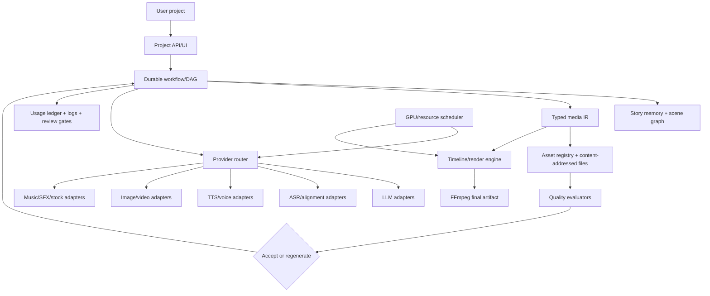

# AI Video Studio Reference Overview

## Executive recommendation

Build the studio as a new product. Reuse proven local libraries and provider ideas behind narrow adapters; do not assemble the product by copying one reference repository.

The strongest combination is:

- **Story workflow:** story-claw's staged chapter/archive/storyboard/render model.
- **Dubbing and worker behavior:** pyvideotrans's explicit stage workers, queues, cancellation, and provider registries; reimplement rather than copy GPL application code.
- **Job API and artifacts:** MoneyPrinter/MoneyPrinterTurbo's job endpoints and per-task artifacts, with real retry/resume semantics added.
- **Audio timing:** whisperX's ASR/alignment and edge-tts boundary model.
- **Local voices:** F5-TTS and GPT-SoVITS behind a shared TTS/voice-profile contract.
- **Narrative memory:** new code. None of the references provides a novel-wide story graph or durable retrieval model.

A basic topic-to-video generator is already demonstrated by `references/MoneyPrinter/Backend/pipeline.py:50-234` and `references/MoneyPrinterTurbo/app/services/task.py:1315-1444`. A novel-to-video studio is not.

## What to reuse, wrap, reimplement, or ignore

| Reference | License observed | Reuse decision | Reason |
|---|---|---|---|
| MoneyPrinterTurbo | MIT | Reuse ideas; wrap provider concepts; reimplement orchestration | Good end-to-end stages in `app/services/task.py:1242-1503`, but tightly coupled to app globals and media implementation |
| pyvideotrans | GPLv3 | Wrap only through process/API boundaries or reimplement behavior | Strong dubbing workers in `videotrans/task/job.py:71-247`; GPL requires deliberate distribution review |
| NarratoAI | MIT | Reuse analysis/service patterns | Useful documentary frame analysis and task manager; not a fiction story engine |
| MoneyPrinter | MIT | Reuse job/API shape and simple pipeline ideas | Clear Flask/worker/DB flow; weak retry/resume and limited modality planning |
| ShortGPT | MIT | Reuse resumable step concept and timed visual query idea | Good step persistence in `abstract_content_engine.py:60-75`; UI and engine are coupled |
| whisperX | BSD 2-Clause | Wrap or vendor under license terms | Focused, high-value ASR/alignment library in `whisperx/transcribe.py` and `alignment.py` |
| edge-tts | Mixed: LGPLv3 except `srt_composer.py` MIT | Isolate as optional process/dependency | Boundary-aware Edge WebSocket client is useful; license boundary must be preserved |
| F5-TTS | MIT repository; audit checkpoints separately | Wrap local inference | Useful zero-shot voice-cloning contract in `infer/utils_infer.py:118-449` |
| GPT-SoVITS | MIT repository; audit checkpoints separately | Wrap local inference/API | Mature local GPT+SoVITS flow in `api_v2.py` and `TTS_infer_pack/TTS.py` |
| story-claw | MIT | Reuse architecture and contracts; reimplement product seams | Closest novel episode pipeline in `runner/pipeline.ts` and `runner/render.ts`; lacks global memory/QC |

Repository license does not automatically license model checkpoints, voice references, downloaded media, or third-party services. Keep an inventory for every shipped model and asset.

## Recommended architecture

### Durable workflow engine

Represent every stage as a node with:

- immutable input references and configuration hash;
- output artifact hashes, media metadata, provider/model identity;
- attempt number, status, error class, logs, and timestamps;
- explicit retry policy and human-review gate;
- dependency invalidation when an upstream artifact changes.

Use filesystem/object storage for large media and a database for manifests, edges, metadata, and state. This preserves the useful artifact model in story-claw while avoiding its file-only coordination limit.

### Typed intermediate representation

Use a stable IR between planning and rendering. At minimum:

- `StoryMemory`: entities, relationships, events, chapter summaries, source spans, version;
- `Scene`: location, time, participants, action, continuity constraints;
- `Shot`: framing, camera motion, prompt, negative prompt, references, duration;
- `VoiceLine`: speaker, text, voice profile, audio, word timings;
- `Asset`: provenance, license, provider, prompt, dimensions, embeddings, parent asset;
- `Timeline`: ordered tracks, clips, transitions, captions, BGM, SFX, loudness targets.

Providers return these contracts rather than leaking SDK response shapes into workflow code. The reusable component proposal is detailed in `reusable-components.md`.

### Story memory and consistency

Implement hierarchical memory before whole-novel generation:

1. ingest and segment source text;
2. extract entities, events, locations, props, and relationships with source spans;
3. maintain chapter and arc summaries;
4. retrieve only relevant memory for a scene/shot;
5. version the memory alongside the project revision;
6. run contradiction and continuity checks before visual generation.

Store canonical character/location/style profiles with references and constraints. Add image/face/style evaluators before claiming consistency. story-claw's archive and reference selection are useful starting points, not a complete memory system.

### Provider and resource layer

Provider adapters should declare capabilities: languages, streaming, cloning, image/video modalities, maximum input, local/cloud, estimated cost, VRAM, and quality tier. The router chooses by project policy and records fallback decisions.

A GPU scheduler should manage leases, model memory profiles, queue priority, cancellation, and cleanup. pyvideotrans's worker count and story-claw's GPU lifecycle are evidence for the need, not a shared scheduler.

## Local-first default profile

| Capability | Default | Optional cloud/high-quality path |
|---|---|---|
| Planning LLM | Ollama/local compatible model | OpenAI, Anthropic, Gemini, DeepSeek, OpenRouter, etc. |
| ASR/alignment | faster-whisper/whisperX | hosted Whisper or AssemblyAI |
| TTS | Edge TTS for low setup; F5-TTS/GPT-SoVITS for local profiles | ElevenLabs, OpenAI, Azure, Gemini, MiniMax |
| Image | local diffusion/ComfyUI when GPU permits; stock fallback | GPT/Gemini image providers |
| Video | local ComfyUI/LTX when available; still-image motion fallback | hosted video generation |
| Translation | local model/service | provider-specific translation APIs |
| Music/SFX | local files or local generation | hosted music/SFX APIs |
| Composition | FFmpeg, with a small timeline engine | none required |

No API key should be required for the baseline workflow. Cloud features must be opt-in and visible in the project/provider profile.

## Progressive product path

### Level 1 — Simple video

Text/script → TTS → stock/image assets → simple timing/animation → subtitles → FFmpeg. Establish artifact manifests, real media probing, and deterministic reruns first. See `workflows/simple-video.md`.

### Level 2 — YouTube Short

Topic → script → timed visual queries → stock/generative assets → TTS → subtitles/BGM → 9:16 composition → metadata/upload. Add durable jobs, cancellation, usage accounting, and upload safety. See `workflows/youtube-short.md`.

### Level 3 — Story video

Chapter → archive → scenes → storyboard panels → character/location references → multi-voice audio → generated visuals → timed episode render. Adopt story-claw's staged design, but put the contracts in the new IR. See `workflows/story-video.md`.

### Dubbing track

Video/SRT → extraction → ASR/diarization → translation → role-aware TTS → alignment → mux. Implement independently from story generation; reuse whisperX and local voice adapters. See `workflows/dubbing.md`.

### Level 4 — Advanced novel video

Whole novel → global memory → world bible → scene graph → chapter/shot plans → references → voices/music/SFX → timeline → evaluation → targeted regeneration. This is the product differentiator and is absent from the references. See `workflows/advanced-story-video.md`.

## Non-negotiable product safeguards

- Do not silently replace a requested provider with a lower-quality fallback; record it.
- Preserve source/license/provenance for generated and downloaded assets.
- Make prompt, model, reference, seed, and artifact hashes inspectable.
- Bound retries and regeneration by project budget and user policy.
- Keep generated media outside the database; keep state and relationships transactional.
- Treat user-provided voice/image references as consent- and rights-sensitive.
- Never call a chapter “consistent” without running explicit evaluators or labeling it unverified.

## Scope conclusion

The references supply working slices, not a drop-in studio. Reuse the narrow, high-confidence components; reimplement orchestration, story memory, scene graph, typed timeline, cost accounting, GPU scheduling, and quality/regeneration loops. This gives the simplest local path to automatic YouTube videos without making the later novel workflow a rewrite.

No implementation changes were made under `references/`; this repository change contains research documentation and the OpenSpec proposal only.
