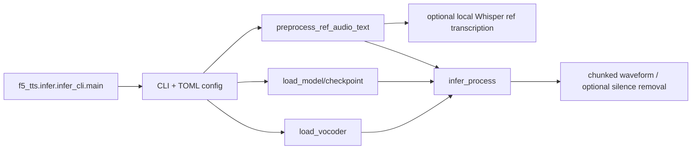

# F5-TTS

## Purpose

F5-TTS is a local flow-matching text-to-speech system for zero-shot voice cloning and expressive synthesis. Given reference audio/text and generation text, it loads a model/vocoder, preprocesses the reference, chunks text, generates waveform segments, cross-fades/concatenates them, and can serve CLI/Gradio/API-style workflows.

## Tech Stack

Python; PyTorch/torchaudio; flow-matching DiT/E2-TTS model architectures; Vocos or BigVGAN vocoder; Hugging Face/cached_path checkpoints; pydub/librosa/soundfile; Gradio; optional Triton/TensorRT-LLM runtime. License: MIT (`references/F5-TTS/LICENSE:1-20`), with third-party components requiring their own terms.

## Architecture

CLI config resolution in `infer_cli.py` selects model, checkpoint, vocoder, device, reference, and output. `utils_infer.py` contains shared preprocessing/inference. The model produces mel-like representations through flow matching; the vocoder turns them into audio. Training and fine-tuning are separate (`src/f5_tts/train/`).

## Entry Points

- Package commands: `references/F5-TTS/pyproject.toml:60-64`.
- CLI: `src/f5_tts/infer/infer_cli.py:177-303,307-388`.
- Gradio: `src/f5_tts/infer/infer_gradio.py`.
- Shared inference: `src/f5_tts/infer/utils_infer.py:73-106,153-184,235-276,298-458`.
- Training/fine-tuning: `src/f5_tts/train/train.py`, `finetune_cli.py`, `finetune_gradio.py`.

## Workflow

CLI merges command-line and TOML values (`infer_cli.py:180-223`), loads a Vocos/BigVGAN vocoder (`:254-263`) and model config/checkpoint (`:266-301`). `main` supports multiple named voices and `[voice]` tags in generation text (`:307-360`), preprocessing each reference. `preprocess_ref_audio_text` hashes reference audio, trims silences/clips to at most roughly 12 seconds, caches the result, and transcribes missing reference text (`utils_infer.py:298-378`). `infer_process` computes a reference-dependent chunk size, splits text, and invokes `infer_batch_process` (`:384-458`); final segments are concatenated and saved (`infer_cli.py:362-384`).

## Important Components

- `utils_infer.py:35-65`: in-process reference audio/text caches and synthesis defaults.
- `utils_infer.py:73-102`: `chunk_text`; prevents oversized conditioning/generation text.
- `utils_infer.py:106-145`: vocoder factory, local or downloaded.
- `utils_infer.py:153-184`: optional ASR pipeline used only to infer missing reference text.
- `utils_infer.py:190-276`: checkpoint/model loader.
- `utils_infer.py:298-378`: audio normalization, silence clipping, MD5 cache, reference transcript.
- `utils_infer.py:384-606`: text-to-wave inference, batches, cross-fade, speed/fix-duration controls.
- `infer_cli.py:322-360`: multi-character voice tags and per-voice reference audio/speed.

## Providers

Local F5-TTS/E2-TTS models; Vocos or BigVGAN vocoder local/downloaded; optional local Whisper/faster-whisper-like ASR for reference text. No cloud TTS API is required. Hugging Face is a checkpoint distribution/cache source, not a runtime speech provider.

## What We Can Reuse

- **DIRECTLY REUSABLE concept/code candidate:** reference preprocessing and cache contract (`utils_infer.py:298-378`) under MIT, after checking third-party notices and adapting file ownership.
- **WRAP:** `infer_process` as an implementation behind a `VoiceCloneProvider`; return waveform plus segment timing generated by the studio, not rely on raw model internals.
- **REFERENCE ONLY:** CLI config and global caches; replace globals with project-scoped model handles and content-addressed reference assets.
- **NOT USEFUL:** training UI for the video studio core; it belongs in a separate voice-model management tool.

## Strengths

Local/private operation; zero-shot reference conditioning; named multi-voice tags; reference audio/text cache; optional automatic transcript; chunking and cross-fade; consumer-GPU/CPU configuration; fine-tuning path.

## Weaknesses

Heavy PyTorch/GPU memory and checkpoint requirements; synthesis timing is not native word-level alignment; quality is sensitive to reference audio/text; global in-memory cache is not durable; no subtitle/translation/video pipeline; model/vocoder licensing and download size complicate turnkey deployment.

## Ideas Worth Copying

Represent a character voice as reference audio + transcript + model parameters; cache normalized references by hash; support multi-voice markup; chunk long text; and expose model loading as a bounded resource that the job scheduler can acquire/release.
