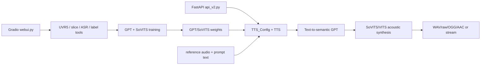

# GPT-SoVITS

## Purpose

GPT-SoVITS is a local voice cloning and TTS training/inference system. It offers dataset preparation, source separation/slicing/ASR preprocessing, GPT and SoVITS fine-tuning, zero-shot/few-shot inference, multi-speaker auxiliary references, streaming output, and HTTP/WebUI access.

## Tech Stack

Python; Gradio WebUI; FastAPI API; PyTorch; GPT-style text-to-semantic model; SoVITS/VITS acoustic model; BERT/CNHubert conditioning; optional vocoder/super-resolution; FFmpeg/soundfile; local checkpoints and config. License: MIT (`references/GPT-SoVITS/LICENSE:1-20`), with included third-party components requiring separate review.

## Architecture

`webui.py` exposes preprocessing/training/inference tabs. `api_v2.py` loads `TTS_Config` and `TTS` once, validates requests, invokes `tts_pipeline.run`, and packages WAV/raw/OGG/AAC responses. `TTS` initializes semantic/acoustic/conditioning models and maintains a prompt cache.

## Entry Points

- WebUI: `references/GPT-SoVITS/webui.py:1305-1979`; preprocessing/training/inference tabs are configured there.
- API: `api_v2.py:133-151,568-576`.
- Request model/handler: `api_v2.py:154-179,305-445`; endpoints at `:455-565`.
- Core inference: `GPT_SoVITS/TTS_infer_pack/TTS.py:421-475,997-1085`.
- Training: `GPT_SoVITS/s1_train.py`, `s2_train.py`, version-specific scripts; dataset prep under `GPT_SoVITS/prepare_datasets/` and `tools/`.

## Workflow

For inference, API config loads model paths and initializes `TTS` (`api_v2.py:133-151`). Requests require synthesis text, target language, reference audio, prompt language, and valid split/media parameters (`:305-342`). `tts_handle` maps streaming modes, calls `tts_pipeline.run`, then yields packed chunks or a complete response (`:345-445`). `TTS.__init__` loads T2S, VITS, BERT, CNHubert and prompt-cache slots (`TTS.py:421-465`); `run` selects batched/naive/streaming inference modes based on model capabilities (`:1033-1085`) and produces audio. Training starts in WebUI tools after source audio slicing, ASR/labelling, feature extraction, and GPT/SoVITS fine-tuning.

## Important Components

- `api_v2.py:154-179`: typed HTTP request controls, including reference paths, auxiliary references, split method, speed, seed, batching, and streaming.
- `api_v2.py:305-445`: validation, streaming response modes, output packaging.
- `GPT_SoVITS/TTS_infer_pack/TTS.py:421-475`: model/prompt-cache owner.
- `TTS.py:997-1085`: inference configuration, seed, batching/streaming conflict handling, model dispatch.
- `GPT_SoVITS/AR/models/t2s_model.py:583-966`: batched/naive semantic generation.
- `tools/slice_audio.py`, `tools/slicer2.py`, `tools/asr/`: dataset preparation primitives.
- `webui.py:1314-1471,1529-1853`: preprocessing and training process controls; `:1854-1979` inference UI.

## Providers

The core provider is local GPT-SoVITS model weights with BERT/CNHubert and VITS/vocoder components. ASR preprocessing can invoke bundled or configured ASR tools; source separation uses UVR5. No external LLM/image/video/translation provider is needed for TTS. Hugging Face/model downloads may be used during setup.

## What We Can Reuse

- **DIRECTLY REUSABLE concept/code candidate:** FastAPI request/streaming contract and reference-audio prompt model; MIT permits reuse with attribution and third-party audit.
- **WRAP:** `TTS` behind a `VoiceCloneProvider`; its stateful GPU models and global-ish prompt cache should be owned by a worker process, not application request handlers.
- **REFERENCE ONLY:** preprocessing/training workflow and multi-stage model stack; useful for voice asset management, not video story planning.
- **NOT USEFUL:** monolithic Gradio training UI in the studio core.

## Strengths

Mature local voice cloning; explicit reference text/language; auxiliary reference fusion; multiple streaming quality modes; batching/parallel inference; training and inference lifecycle; HTTP API; broad Chinese/multilingual support.

## Weaknesses

Large model stack and GPU requirements; path-based API accepts local file references and needs sandboxing in a multi-user app; no native word-level output contract; no job queue/cost accounting; complex versions/model compatibility; prompt cache is process-local.

## Ideas Worth Copying

Store voice profiles as model version + reference assets + prompt language/text; isolate loaded model workers; support streaming but retain complete-file mode for rendering; validate language/media/split parameters up front; and preserve seeds/model IDs for reproducibility.
