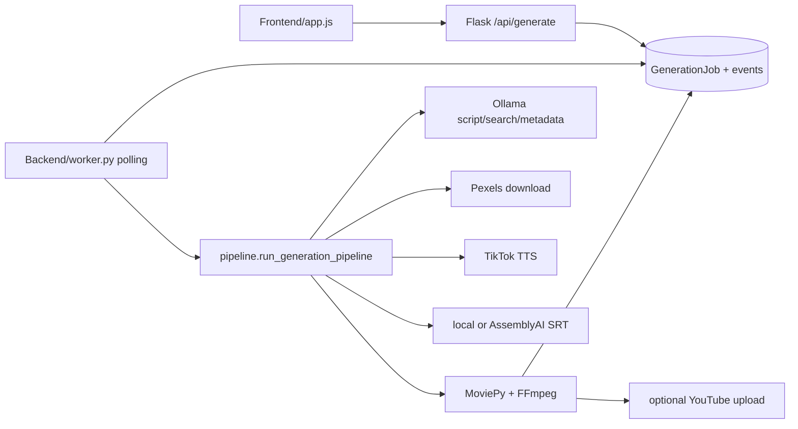

# MoneyPrinter

## Purpose

MoneyPrinter is a small web application for automated YouTube/TikTok-style videos from a subject. It uses a local Ollama model for script/search metadata, Pexels stock video, TikTok TTS, local/AssemblyAI subtitles, MoviePy composition, optional local music, and optional YouTube upload.

## Tech Stack

Python Flask API; SQLAlchemy/SQLite-style repository; background polling worker; vanilla HTML/JavaScript frontend; Ollama; Pexels; TikTok voice endpoint; AssemblyAI optional; MoviePy and FFmpeg; filesystem temp/subtitle/song directories. License: MIT (`references/MoneyPrinter/LICENSE:1-20`).

## Architecture

`Backend/main.py` initializes environment/database and exposes job APIs. `repository.py` persists `GenerationJob`, `GenerationEvent`, scripts, and artifacts. `worker.py` polls and claims jobs. `pipeline.py` is a linear function with cancellation guards.

## Entry Points

- API server: `references/MoneyPrinter/Backend/main.py:15-20,26-184`.
- Job enqueue/status/events/cancel: `main.py:49-130`.
- Worker: `Backend/worker.py:35-76`; `process_next_job` claims one queued job and calls the pipeline.
- Core workflow: `Backend/pipeline.py:35-365`.
- Frontend: `Frontend/index.html` and `Frontend/app.js` submit and stream events.

## Workflow

`run_generation_pipeline` reads subject/config and checks cancellation (`pipeline.py:46-63`), defaults the voice, generates script (`:65-85`), obtains search terms (`:86-105`), queries/downloads stock video (`:90-118`), splits script on `. ` and synthesizes each sentence with `tiktokvoice.tts` (`:123-142`), creates local or AssemblyAI subtitles and equalizes them (`video.py:118-159`), loops/crops/concatenates stock clips to narration duration (`video.py:162-265`), burns subtitles and adds audio (`video.py:268-345`), creates YouTube metadata and optionally uploads (`pipeline.py:181-232`), then optionally mixes local BGM with MoviePy/FFmpeg (`:240-346`).

## Important Components

- `Backend/main.py:49-130`: HTTP job lifecycle. Input JSON; output job ID/status/events.
- `Backend/models.py:20-79`: `GenerationJob` stores status, JSON payload, cancellation, attempts, result/error timestamps; `GenerationEvent` stores logs.
- `Backend/worker.py:35-62`: single polling worker, cleanup, pipeline call, terminal status updates.
- `Backend/repository.py`: claim/mark/append operations; DB-backed job state.
- `Backend/gpt.py:67-351`: Ollama response, script, search term, and metadata generation.
- `Backend/search.py`: Pexels query and stock URL selection.
- `Backend/tiktokvoice.py`: TTS HTTP/client implementation.
- `Backend/video.py:49-159`: AssemblyAI or duration-derived local subtitles; `:162-345` composition.
- `Backend/youtube.py`: Google API upload.

## Providers

LLM is local Ollama (`gpt.py:15-21`), defaulting to `llama3.1:8b`; no cloud LLM abstraction. Visuals are Pexels cloud stock. TTS is TikTok voice service. ASR/subtitles are optional AssemblyAI cloud or local sentence-duration alignment. Music is local `Songs/`; YouTube uses Google OAuth client secrets.

## What We Can Reuse

- **DIRECTLY REUSABLE concept:** `GenerationJob`/`GenerationEvent` persistence shape (`Backend/models.py:20-79`) for a minimal durable queue. Preserve attempts/result/error timestamps, but add stage records for a serious workflow.
- **REFERENCE ONLY:** linear pipeline and cancellation callback (`pipeline.py:35-63`); useful minimal baseline for Level 1/2.
- **REFERENCE ONLY:** local subtitle fallback (`video.py:81-115`); acceptable when TTS segments already define timings, but not word-level.
- **NOT USEFUL:** TikTok voice scraping/service coupling and frontend-specific YouTube upload assumptions.

## Strengths

Small, understandable end-to-end baseline; database-backed jobs/events; cancellation checks between expensive steps; local Ollama makes script generation cheap; simple local BGM fallback; clear API contract and worker separation.

## Weaknesses

No retries despite `attempt_count/max_attempts` fields being modeled; one worker serializes all jobs; no resume at stage granularity; naive sentence splitting; no image generation or story model; download uses direct response content without robust provider/cache abstraction; subtitle local mode is sentence-level only. The pipeline kills all FFmpeg processes at the end (`pipeline.py:350-363`), which is unsafe for shared workers.

## Ideas Worth Copying

Start with a DB-backed job/event API and a polling worker, but replace global temp cleanup with per-job directories, add stage manifests/retries, use an LLM provider adapter, and make subtitle/timeline data explicit rather than derived from sentence order.
