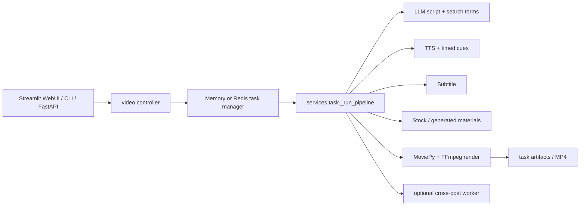

# MoneyPrinterTurbo

## Purpose

MoneyPrinterTurbo is a Python video-generation service for short-form videos. It turns a topic into an LLM script, search terms, narration, subtitles, stock/generated visual materials, and a rendered MP4; it also exposes intermediate artifacts and optional cross-posting.

## Tech Stack

Python; FastAPI/Uvicorn; Pydantic models; Streamlit WebUI (`webui/Main.py`); MoviePy plus FFmpeg; requests/aiohttp; optional Redis; local filesystem task artifacts; Edge TTS and multiple cloud/local TTS adapters; OpenAI-compatible and protocol-specific LLM adapters; Pexels, Pixabay, Coverr, WaveSpeed, Volcano Seedance, TwelveLabs, Sonilo, ElevenLabs music, and upload integrations. License: MIT (`references/MoneyPrinterTurbo/LICENSE:1-20`).

## Architecture

The ASGI application (`references/MoneyPrinterTurbo/app/asgi.py:65-85`) mounts controllers and task/public static files. `app/controllers/v1/video.py:181-206` creates/query tasks and selects either `InMemoryTaskManager` or `RedisTaskManager` (`:43-70`). The shared service pipeline is in `app/services/task.py`; media rendering is in `app/services/video.py`; speech, subtitles, materials, BGM, and LLMs are separate services.

## Entry Points

- Server: `references/MoneyPrinterTurbo/main.py:6-17` runs `uvicorn` against `app.asgi:app`.
- API: `app/controllers/v1/video.py:181-206` routes `/videos`, `/audio`, `/subtitle`; task status is exposed at `:240-287`.
- CLI: `references/MoneyPrinterTurbo/cli.py` (the file is a 57 KB command-line surface) ultimately calls the same task service.
- WebUI: `webui/Main.py` provides Streamlit controls and task polling.
- Pipeline: `app/services/task.py:1242-1503` is the authoritative end-to-end orchestration.

## Workflow

`_run_pipeline` preflights provider keys and FFmpeg (`:1253-1313`), generates a script (`:1315-1323`), creates visual search terms (`:1333-1344`), generates narration (`:1354-1378`), creates subtitles (`:1380-1392`), downloads/generates materials (`:1396-1418`), renders final videos (`:1427-1444`), persists all output fields, and asynchronously schedules optional social uploads (`:1450-1503`). It supports `stop_at` checkpoints for script, terms, audio, subtitle, materials, or final video.

## Important Components

- `app/services/llm.py:142-407`, `generate_script` at `:503-580`, `generate_terms` at `:599-704`: prompt construction, response normalization, retries, provider-specific parsing. Input topic/parameters; output script or ordered terms.
- `app/models/llm_provider.py:7-34,187-424`: registry of provider metadata, endpoints, defaults, and protocol adapters. This is an adapter registry, not a job system.
- `app/services/voice.py:455-553`: dispatches voice names to Edge/Azure/SiliconFlow/Gemini/MiMo/MiniMax/ElevenLabs/Chatterbox/Fish Audio and returns a `SubMaker` when timed events are available. `:833-1887` contains provider implementations; `:2113-2183` writes subtitle cues and measures duration.
- `app/services/material.py:296-605`: Pexels/Pixabay/Coverr searches and aspect filtering; `:699-989` implements WaveSpeed text-to-video polling/download; `:1052-1578` adds caching and script-order downloading.
- `app/services/video.py:332-392`: FFmpeg concat; `combine_videos` at `:538-762`; `generate_video` at `:991-1297`; MoviePy composes clips/audio/subtitles/BGM and has encoder fallback.
- `app/services/state.py`, `app/services/task_artifacts.py`: task state and script/artifact persistence. `app/services/task.py:971-1015` recovers interrupted cross-posts.
- `app/services/bgm.py`, `elevenlabs_music.py`, `sonilo.py`: local or generated BGM/SFX integrations.

## Providers

LLM registry includes Moonshot, OpenAI, Anthropic, Gemini, DeepSeek, Qwen, Azure, VolcEngine, Grok, MiniMax, MiMo, OpenRouter, Ollama, LiteLLM, Groq, Pollinations, and OpenAI-compatible gateways (`app/models/llm_provider.py:187-424`). TTS includes Edge TTS, Azure, Gemini, MiMo, MiniMax, ElevenLabs, Chatterbox, Fish Audio, and local/self-hosted endpoints. ASR is mainly implicit through TTS cue generation or optional subtitle/material services rather than a first-class ASR registry. Visuals include Pexels/Pixabay/Coverr, WaveSpeed T2V, and Volcano Seedance. Music includes local files, ElevenLabs, and Sonilo.

## What We Can Reuse

- **DIRECTLY REUSABLE concept/code candidate:** `VideoParams`/`MaterialInfo` data contracts (`app/models/schema.py:56-113`) and the provider registry shape. MIT permits reuse with notices, but current service code is tightly coupled to this app's config and response schema.
- **REFERENCE ONLY:** `_run_pipeline` checkpoint ordering and `material.py` provider/cache behavior. Rebuild around durable workflow records rather than copy global state.
- **REFERENCE ONLY:** `video.py` MoviePy composition; useful for compatibility, but a future timeline engine should own a declarative timeline and use FFmpeg for deterministic finalization.
- **NOT USEFUL for the long-story core:** cross-posting and platform-specific publication logic.

## Strengths

Clear shared pipeline across API, CLI, and WebUI; intermediate stop points; broad provider registry; Redis option; artifact URLs and path security; explicit FFmpeg probing and codec fallback; material-source persistence; optional music providers with common interface; graceful cross-post isolation.

## Weaknesses

Task state is still service-centric rather than a durable DAG of every stage. Script structure is short-video oriented; no character/world memory, scene graph, or shot-level visual continuity. MoviePy and filesystem conventions are tightly coupled. Provider fallback is uneven; many providers are dispatch branches rather than interchangeable typed adapters. Stock retrieval dominates the visual path, while generated video is an optional material source.

## Ideas Worth Copying

Use one pipeline entry point for all front ends, explicit stop-at artifacts, a registry describing provider configuration, material records with source metadata, and a render layer that probes available FFmpeg codecs. Add durable stage manifests and content-addressed assets before extending this approach to novels.
