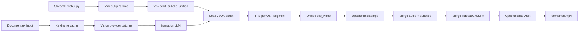

# NarratoAI

## Purpose

NarratoAI is a Streamlit-based AI narration and video-processing application. Its current integrated paths cover documentary/video understanding, narration-script generation, short-drama/script workflows, TTS, video clipping, subtitle/BGM/audio composition, and optional Jianying export.

## Tech Stack

Python; Streamlit (`webui.py`); Pydantic schemas; asyncio/threaded task execution; OpenAI-compatible LLM/vision adapters and optional TwelveLabs; FFmpeg/ffprobe; MoviePy compatibility utilities; Edge/Azure/cloud/local TTS packs; SRT/ASS subtitle tooling; filesystem task storage. License: MIT (`references/NarratoAI/LICENSE:1-20`).

## Architecture

The UI merges script/video/audio/subtitle settings into `VideoClipParams` and launches a background thread (`webui.py:209-372`). `app/services/task.py` persists progress and orchestrates six stages. The documentary path is a separate service: frame extraction → batched vision analysis → analysis artifact → narration LLM → script JSON. LLM provider registration and instance caching are in `app/services/llm/manager.py`.

## Entry Points

- WebUI: `references/NarratoAI/webui.py:1-14,653-720`; generation callback `:209-372`.
- Documentary script API: `app/services/script_service.py:8-40` delegates to `DocumentaryFrameAnalysisService`.
- Documentary analysis: `app/services/documentary/frame_analysis_service.py:37-179`.
- Unified render pipeline: `app/services/task.py:644-1003`.
- Composition engine: `app/services/generate_video.py:1339-1751`.
- Optional Jianying draft workflow: `app/services/jianying_task.py` and UI handlers around `webui.py:411-649`.

## Workflow

The unified path loads a saved JSON script whose items contain `narration`, `OST`, and timestamps (`task.py:675-694`). It TTS-generates only OST 0/2 segments (`:697-727`), clips original videos against those results (`:729-755`), updates timeline timestamps, merges audio and subtitles (`:764-830`), concatenates video clips (`:832-870`), then mixes narration, original audio, BGM, subtitles, and optional Sonilo SFX (`:872-958`). If enabled, it transcribes the merged result and burns automatically generated subtitles (`:960-982`). Progress has step and FFmpeg fields.

The documentary path checks provider/model config, extracts or loads cached keyframes, batches them, runs concurrent vision analysis, sorts results, saves JSON/markdown artifacts, creates clip records, then sends markdown plus theme/custom prompt to a text LLM to produce narration items (`frame_analysis_service.py:37-95,97-179`).

## Important Components

- `webui.py:209-372`: validates required script/original video, combines settings, launches task thread, polls state, and displays output.
- `app/services/task.py:644-1003`: six-stage orchestration with OST-aware TTS, clip/timestamp update, audio/subtitle merge, final composition, optional auto-ASR.
- `app/services/documentary/frame_analysis_service.py:283-338`: keyframe cache and extraction; `:340-410` concurrent batch analysis; `:449-510` artifact building/saving.
- `app/services/llm/unified_service.py:21-283`: stable text/image/narration/subtitle methods over manager/provider instances.
- `app/services/llm/manager.py:15-26,28-38,92-225`: explicit registration, provider factory, cached instances, provider info.
- `app/services/voice.py:1147-1331,1794-1900`: provider dispatch and multi-segment TTS returning audio plus subtitle timing; local/HTTP clone packs are implemented later in the same module.
- `app/services/generate_video.py:1045-1336,1339-1751`: FFmpeg command builder, progress reporting, subtitle ASS/drawtext fallbacks, audio normalization, BGM and mux.
- `app/services/clip_video.py`, `audio_merger.py`, `subtitle_merger.py`: clip/timeline and intermediate artifact operations.

## Providers

Text/vision: OpenAI-compatible endpoints including OpenAI, DeepSeek, Gemini/Qwen gateways, SiliconFlow, OpenRouter, Moonshot, Anthropic-compatible services; TwelveLabs Pegasus is an optional native video-understanding provider (`config.example.toml:35-43`). TTS: Edge/Azure, Tencent, Qwen3, Doubao, SoulVoice, IndexTTS/IndexTTS-2, OmniVoice, VoxCPM, and related local HTTP packs (`config.example.toml:113-297`). ASR: FunASR local/FireRed/local or Bailian cloud and configurable auto-transcription. Music/SFX: local BGM plus optional Sonilo AI (`config.example.toml:71-83`).

## What We Can Reuse

- **DIRECTLY REUSABLE concept/code candidate:** `UnifiedLLMService` + explicit manager registration (`app/services/llm/`) as a provider façade. MIT permits reuse with notice; refactor config and async contracts before adoption.
- **REFERENCE ONLY:** documentary keyframe batching/cache. Strong pattern for video understanding, but it assumes vision narration rather than story memory.
- **REFERENCE ONLY:** six-step task progress schema and FFmpeg progress callbacks; preserve observable progress, redesign persistence as durable stage records.
- **REFERENCE ONLY:** `generate_video.merge_materials`; useful FFmpeg fallback engineering, but a future studio needs a more general timeline contract.
- **NOT USEFUL:** Streamlit-specific settings/UI and Jianying export for the core product.

## Strengths

Best source for batched video understanding and prompt/provider separation; explicit cache keys and analysis artifacts; structured progress UI; robust subtitle/audio composition; many local TTS options; useful optional SFX/BGM fallback behavior; tests cover edge cases.

## Weaknesses

The main render pipeline consumes a prebuilt script JSON rather than planning scenes from a novel. Documentary parameters include warnings for unsupported options (`script_service.py:25-30`). Provider registration is explicit but global and process-scoped. Task persistence is state-dict oriented; no first-class cost, retries per stage, or provider fallback policy. Character/location/style memory is absent.

## Ideas Worth Copying

Use an explicit provider manager with cached instances; cache expensive keyframes by source/config; retain analysis artifacts; make progress stage-aware; build FFmpeg commands from capability probes; and preserve fallback order for subtitles/audio without silently claiming quality parity.
