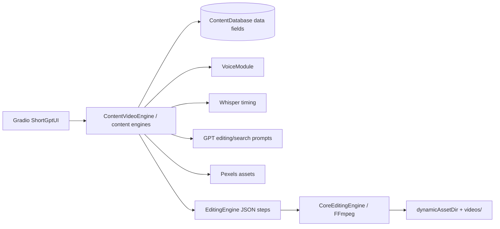

# ShortGPT

## Purpose

ShortGPT is a Gradio automation framework for shorts, stock-asset videos, multilingual video translation, Reddit/facts/content formats, and reusable editing steps. Its key contribution is a resumable content engine backed by a small database and a JSON-defined editing schema.

## Tech Stack

Python; Gradio UI; GPT/OpenAI-style content modules; Edge TTS and ElevenLabs voice modules; Pexels image/video API; Whisper-based timing utilities; JSON/file-backed content database and asset database; MoviePy/FFmpeg editing core. License: MIT (`references/ShortGPT/LICENSE:1-20`).

## Architecture

The UI (`gui/gui_gradio.py`) hosts content automation, asset library, and configuration tabs. Engines inherit `AbstractContentEngine`, persist `_db_*` fields through `ContentDataManager`, and execute numbered step dictionaries. `EditingEngine` turns JSON templates into a visual/audio schema consumed by `CoreEditingEngine`.

## Entry Points

- `references/ShortGPT/runShortGPT.py:1-4` constructs and launches `ShortGptUI`.
- `gui/gui_gradio.py:19-37` builds the tabs and starts Gradio on port 31415.
- `shortGPT/engine/content_video_engine.py:19-43` defines the general stock-video engine and its steps.
- Other engines: `content_short_engine.py`, `reddit_short_engine.py`, `facts_short_engine.py`, `multi_language_translation_engine.py`.

## Workflow

`ContentVideoEngine` registers ten steps (`content_video_engine.py:32-43`): temp TTS (`:45-56`), optional speed adjustment (`:58-66`), ASR caption timing via `audio_utils.audioToText` and `captions.getCaptionsWithTime` (`:68-75`), timed LLM video search terms (`:77-80`), Pexels URL selection per time range (`:82-95`), background music lookup (`:97-100`), asset duration preparation (`:101-106`), placeholder custom assets (`:108-110`), JSON editing schema creation (`:112-142`), and generated YouTube metadata/file move (`:144-159`). The engine persists the last completed step, so `makeContent` can resume (`abstract_content_engine.py:60-75`).

## Important Components

- `shortGPT/engine/abstract_content_engine.py:12-27,29-52`: content base class, DB-backed field persistence, dynamic asset directory, FFmpeg checks.
- `abstract_content_engine.py:60-75`: numbered resumable workflow.
- `shortGPT/engine/content_video_engine.py:19-159`: integrated script-to-stock-video path.
- `shortGPT/audio/voice_module.py:1-16`: minimal provider interface (`generate_voice`, usage/remaining quota).
- `shortGPT/audio/edge_voice_module.py:16-51`, `eleven_voice_module.py`: provider implementations.
- `shortGPT/editing_framework/editing_engine.py:17-103`: `EditingStep` enum, JSON templates, schema assembly, render entry points.
- `shortGPT/editing_framework/core_editing_engine.py`: execution of visual/audio schema using the underlying media engine.
- `shortGPT/config/asset_db.py` and `shortGPT/database/content_database.py`: assets and persisted content records.
- `shortGPT/gpt/gpt_editing.py`, `gpt_translate.py`, `gpt_yt.py`: search queries, translation, metadata prompts.

## Providers

LLM modules expect OpenAI/GPT-style credentials and prompt helpers. TTS is Edge TTS or ElevenLabs. ASR timing is local Whisper-related code through `audio_utils`. Visuals are Pexels stock video/images. Rendering is local MoviePy/FFmpeg. No image/video generative model, voice cloning, ComfyUI, or provider fallback registry is integrated in the general engine.

## What We Can Reuse

- **DIRECTLY REUSABLE concept/code candidate:** `AbstractContentEngine` numbered step/resume contract and `EditingEngine` schema/template approach; MIT allows reuse with attribution, but update mutable DB field mechanics.
- **REFERENCE ONLY:** `VoiceModule` interface; too small for modern provider metadata, timing, cloning, and cost reporting.
- **REFERENCE ONLY:** timed query shape `[[t1,t2], terms]`; useful for shot/asset planning but should become typed scene/timeline data.
- **NOT USEFUL:** GUI and hard-coded stock workflows for a long-story studio.

## Strengths

Simple resumable step engine; persistent dynamic assets; explicit JSON editing templates; separation of content planning from editing execution; timed visual search; multiple content modes; voice abstraction; easy Gradio deployment.

## Weaknesses

Several steps are placeholders (`_prepareCustomAssets`), persistence is implicit through magic `_db_` attributes, and the editing schema is not a rich timeline/scene graph. No long-context story memory, character consistency, generated visuals, quality loop, or durable queue. The ASR caption path uses audio timing but is not WhisperX word alignment by default.

## Ideas Worth Copying

Persist every workflow stage and artifact, use declarative editing steps, allow restart from the last valid stage, and keep provider-specific content generation outside the renderer. Replace the JSON template schema with a typed timeline IR once story workflows are introduced.
