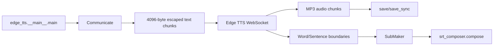

# edge-tts

## Purpose

edge-tts is a Python client and CLI for Microsoft Edge's online speech synthesis service. It streams MP3 audio and WordBoundary/SentenceBoundary metadata, supports voice discovery/filtering, SSML rate/volume/pitch settings, proxies, long-text chunking, and SRT generation.

## Tech Stack

Python; asyncio/aiohttp WebSocket; certifi SSL; Microsoft Edge TTS WebSocket protocol; CLI utilities; SRT composer. License is mixed: only `src/edge_tts/srt_composer.py` is MIT; remaining files are LGPLv3 (`references/edge-tts/LICENSE:1-19`). This makes direct embedding of the full package a licensing decision, not a default recommendation.

## Architecture

`Communicate` validates and chunks text, opens the service WebSocket, sends speech configuration and SSML, parses binary audio and metadata frames, compensates offsets using CBR byte counts, and exposes async/sync stream/save methods. `VoicesManager` is a remote voice catalog/filter utility.

## Entry Points

- CLI: `references/edge-tts/src/edge_tts/__main__.py:1-6` delegates to `util.main`.
- Library export: `src/edge_tts/__init__.py`.
- Transport: `src/edge_tts/communicate.py:321-658`.
- Voice list/filtering: `src/edge_tts/voices.py:19-122`.
- Subtitles: `src/edge_tts/submaker.py:10-57` and `srt_composer.py`.
- Integration examples under `references/edge-tts/examples/` show sync/async audio and subtitle consumption.

## Workflow

`Communicate.__init__` creates `TTSConfig`, sanitizes/escapes input, and splits it at 4096 bytes (`communicate.py:327-369`). `stream` permits one invocation and retries a 403 after DRM handling (`:566-597`). `__stream` sends speech config/SSML, parses `audio.metadata` to boundary chunks and binary MP3 frames (`:425-565`), compensating metadata offsets across chunks from actual CBR bytes (`:405-423`). `save` writes audio and optional JSONL metadata (`:599-621`), while `SubMaker.feed` converts boundaries into timestamped cues (`submaker.py:19-47`) and `get_srt` serializes them.

## Important Components

- `communicate.py:194-260`: safe UTF-8/byte-length text chunking.
- `communicate.py:263-285`: SSML construction.
- `communicate.py:327-384`: validated configuration/state.
- `communicate.py:386-423`: boundary parsing and offset correction.
- `communicate.py:425-565`: WebSocket protocol and audio stream.
- `communicate.py:566-658`: async/sync public APIs.
- `voices.py:58-122`: voice discovery and attribute search.
- `submaker.py:10-57`: cue generation from service metadata.

## Providers

One cloud provider: Microsoft Edge TTS, no API key in the client protocol, but network/service availability and terms apply. No local model, translation, ASR, image, video, or render provider.

## What We Can Reuse

- **DIRECTLY REUSABLE concept:** `SubMaker`/boundary-to-SRT data contract; the small MIT-licensed `srt_composer.py` is the safest direct code candidate, subject to preserving its notice.
- **WRAP:** `Communicate` behind a studio `TTSProvider` so LGPL obligations, network errors, service changes, and voice metadata do not leak into the core.
- **REFERENCE ONLY:** WebSocket offset compensation and long-text chunking; reimplement if license boundary or service stability requires it.
- **NOT USEFUL:** Edge DRM/protocol internals as a general provider architecture.

## Strengths

Excellent word/sentence timing; robust long-text splitting; async and sync APIs; voice catalog; streaming; proxy/timeout controls; explicit protocol validation and offset correction.

## Weaknesses

Cloud-only and service-dependent; no voice cloning; no cost/quota accounting; license split complicates code copying; protocol can change; metadata is timing for generated speech, not semantic speaker/scene data.

## Ideas Worth Copying

Make TTS outputs include audio chunks plus timing events; normalize long input safely; expose async and blocking adapters; persist raw metadata for audit; and keep provider transport hidden behind a stable interface.
