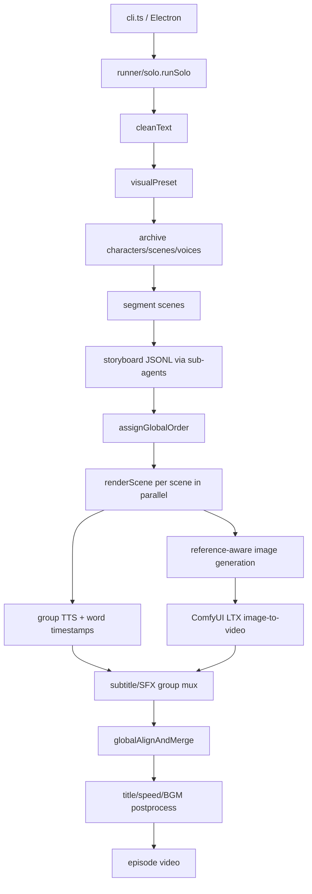

# story-claw

## Purpose

story-claw is a TypeScript/Node/Electron CLI/desktop pipeline for converting novel chapters into short-drama visual episodes. It performs text cleaning, visual preset annotation, character/location resource archiving, scene segmentation, LLM storyboard generation, per-panel image generation, ComfyUI image-to-video generation, multi-character TTS, timed subtitles/SFX, global audio-video alignment, and postprocessing.

## Tech Stack

TypeScript/Node ESM; CLI and Electron desktop UI; Pi agent core/coding-agent sub-agents; OpenAI/Anthropic/Google model formats; OpenAI-compatible LLM calls; Python image helpers; GPT image and Gemini image APIs; ComfyUI HTTP API with LTX workflow JSON; Doubao TTS chunked HTTP; FFmpeg/ffprobe; filesystem workspace JSON/JSONL/Markdown artifacts; semaphores for global concurrency. License: MIT (`references/story-claw/LICENSE:1-20`).

## Architecture

`cli.ts` handles selection and runs `runner/solo.ts`. The runner is a durable, stage-aware episode workflow using `utils/progress.ts`. `runner/pipeline.ts` uses tool-enabled sub-agents to write intermediate artifacts. `runner/render.ts` converts JSONL panels into image/video/audio assets and merges them.

## Entry Points

- CLI: `references/story-claw/cli.ts:18-85`; package command maps `bin/cli.js` to it (`package.json:20-44`).
- Electron: `desktop/main.cjs`, `desktop/agent-worker.ts`.
- Episode orchestration: `runner/solo.ts:45-300`.
- Planning stages: `runner/pipeline.ts:493-793,810-1024`.
- Rendering: `runner/render.ts:1416-1695`; merge `:1738-1930`.
- Agent/provider infrastructure: `agent.ts:28-268`.

## Workflow

`runSolo` reads per-episode progress and skips completed stages (`solo.ts:60-103`). It cleans source text, generates a visual preset, archives new characters/scenes and persistent stages (`:105-123`), segments scripts, creates storyboards in parallel, assigns global order, optionally starts a metered GPU instance, renders scenes in parallel, globally aligns/merges scenes, then postprocesses and finalizes progress (`:125-277`). `pipeline.ts` has explicit sub-agent prompts for visual preset, archive, segment, and storyboard (`:29-417`). Archive can look up later chapters only when needed and generates character/scenery references in dependency order (`:556-696`). Storyboarding uses an `append_group` tool that validates JSON, marks source lines processed, enforces max panel duration, and waits for stalled sub-agents (`:865-1024`).

`renderScene` parses JSONL groups and builds a resource catalog (`render.ts:1422-1444`). It TTS-generates group audio first so real durations drive panel video length (`:1448-1456`). Panels concurrently generate reference-aware images and ComfyUI videos, while continuation panels wait for prior video and use its last frame (`:1497-1599`). Completeness gates prevent missing panel assets from being merged (`:1604-1632`). Group panels are normalized, concatenated, and ASS subtitles burned (`:1301-1398`), then global merge sorts `global_order`, probes durations/dimensions, and adjusts audio to preserve original video frame timing (`:1724-1798`).

## Important Components

- `agent.ts:82-140`: shared model/auth/registry/settings initialization; `:145-177` creates sessions; `:201-268` runs sub-agents with event logs, retries, tool events, and temp session cleanup.
- `runner/pipeline.ts:518-548`: source text → visual preset; `:556-696`: character/location archive + reference image generation; `:760-793`: scene segmentation; `:810-1024`: storyboard JSONL with validation/continuation context.
- `tools/generate-character.ts`, `tools/generate-scene.ts`, `tools/schemas.ts`: persistent resource metadata and image generation.
- `runner/render.ts:338-591`: resource catalog and LLM selection of applicable references.
- `render.ts:612-678`: GPT image primary, safety-prompt softening, retry, Gemini fallback.
- `render.ts:687-794`: ComfyUI workflow injection, duration/frame calculation, history polling, download/retry.
- `render.ts:826-887`: Doubao TTS streaming chunks and optional timestamp flattening.
- `render.ts:1017-1257`: LLM speaker split, per-character voices, TTS retries/quality check, SFX anchors, subtitle timing, concatenation.
- `render.ts:1301-1398`: FFmpeg normalization/concat/ASS burn; `:1738-1930`: alignment/mux.
- `utils/progress.ts`, `utils/paths.ts`: episode stage persistence and deterministic workspace paths.

## Providers

LLM sub-agents support OpenAI, Anthropic, Google model formats (`agent.ts:30-37`), with a configured model registry and optional base URL. Image generation uses GPT image Python helper and Gemini fallback. Video generation is ComfyUI/LTX over HTTP. TTS is Doubao V3 HTTP chunked streaming. Music/SFX are local catalogs plus `utils/generate-bgm.ts`; visual references are local workspace images. FFmpeg is local. GPU lifecycle uses `scripts/grab_gpu.py`/`shutdown_gpu.py` and can be an external metered instance.

## What We Can Reuse

- **DIRECTLY REUSABLE concept/code candidate:** staged novel workflow, persistent character/location assets, JSONL storyboard contract, global order, continuation frames, and progress state. MIT allows code reuse with attribution, but TypeScript/Pi-agent/ComfyUI coupling argues for wrapping concepts.
- **WRAP:** image/video/TTS helpers as provider adapters; preserve retry/quality/fallback semantics while replacing provider credentials and workspace assumptions.
- **REFERENCE ONLY:** sub-agent tool orchestration; useful for interactive planning but deterministic production should validate every artifact and persist every call.
- **NOT USEFUL:** Electron/CLI presentation and metered-GPU scripts as core architecture.

## Strengths

Most complete reference for novel-to-video; explicit character/location reference management; later/prior chapter lookup; scene and shot planning; panel-level duration; image-to-video continuation; multiple voices; word timestamps; SFX anchors; global concurrency; retries/fallbacks; completeness gates; persistent per-stage resume; GPU cost shutdown.

## Weaknesses

Provider set is narrow and primarily cloud/ComfyUI-specific; no automated visual quality evaluator/regeneration loop beyond generation errors and TTS speed sanity check; progress is JSON/file based rather than transactional; sub-agent outputs remain prompt-sensitive; story memory is mostly artifacts and selective chapter reads, not a queryable scene graph/knowledge store; cost accounting is not integrated.

## Ideas Worth Copying

Build a story workspace with character/location/style assets; require structured JSONL scene/group/panel contracts; make TTS duration drive video generation; use continuation last frames; enforce global semaphores; persist stage progress and raw prompts; validate completeness before merge; sort by global order; keep GPU lifecycle in `finally`; and use provider fallback only at explicit boundaries.
