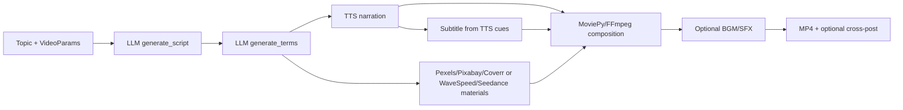
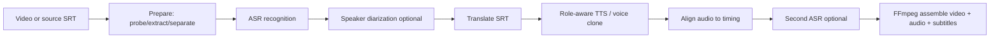
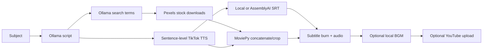
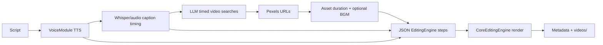
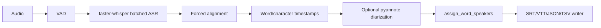
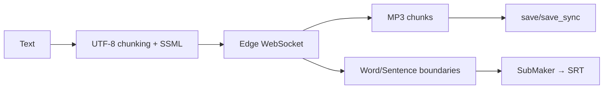
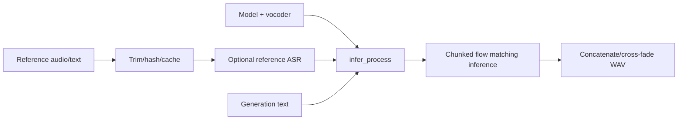
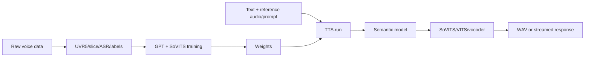
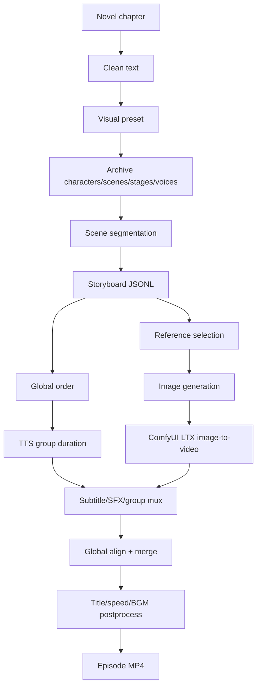

# Workflow Comparison

These diagrams describe workflows found in source, not proposed future workflows. A box marked “optional” is an actual optional branch in the cited implementation.

## MoneyPrinterTurbo: topic to stock/generated-material short

Source: `references/MoneyPrinterTurbo/app/services/task.py:1242-1503`.

Not present: novel memory, character bible, shot planning, reference-conditioned image generation, or a general storyboard graph.

## pyvideotrans: video dubbing/translation

Source: `references/pyvideotrans/videotrans/task/job.py:71-206`; stage mixins.

This is the strongest real dubbing workflow. It is not an image/video-generation workflow.

## NarratoAI: documentary understanding to narrated video

Source: `references/NarratoAI/app/services/documentary/frame_analysis_service.py:37-179`; `app/services/task.py:644-1003`.

```mermaid
flowchart LR
 A[Input video] --> B[Extract/cache keyframes]
 B --> C[Concurrent vision batches]
 C --> D[Analysis JSON/Markdown artifact]
 D --> E[Text LLM narration script]
 E --> F[OST-aware TTS]
 F --> G[Unified video clipping]
 G --> H[Merge audio + generated subtitles]
 H --> I[Mix BGM/SFX and render FFmpeg]
 I --> J[Optional final ASR and subtitle burn]
```

The unified render path can also start with a pre-authored JSON script rather than generated documentary analysis.

## MoneyPrinter: minimal local-first automatic video

Source: `references/MoneyPrinter/Backend/pipeline.py:35-365`.

The worker/API/job database is real (`Backend/worker.py:35-76`, `models.py:20-79`), but the pipeline has no stage resume or retry implementation.

## ShortGPT: step engine and JSON editing schema

Source: `references/ShortGPT/shortGPT/engine/content_video_engine.py:32-159`; `editing_framework/editing_engine.py:17-103`.

The numbered engine persists `_db_last_completed_step` and assets, enabling restart from the last completed step (`abstract_content_engine.py:60-75`).

## whisperX: ASR/alignment/diarization utility

Source: `references/whisperX/whisperx/transcribe.py:124-238`.

## edge-tts: streamed speech with cue metadata

Source: `references/edge-tts/src/edge_tts/communicate.py:425-658`; `submaker.py:19-57`.

## F5-TTS: local reference-conditioned cloning

Source: `references/F5-TTS/src/f5_tts/infer/infer_cli.py:307-384`; `infer/utils_infer.py:298-458`.

## GPT-SoVITS: local training and API inference

Source: `references/GPT-SoVITS/api_v2.py:305-445`; `GPT_SoVITS/TTS_infer_pack/TTS.py:421-475,997-1085`.

## story-claw: novel episode to panel video

Source: `references/story-claw/runner/solo.ts:60-277`; `runner/render.ts:1416-1695`.

This is the only reference with an integrated novel → story asset archive → storyboard → generated image/video path.
