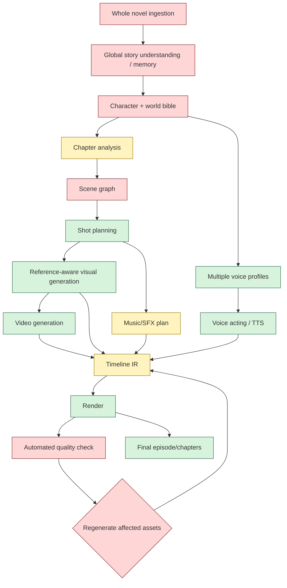

# Level 4: Advanced Story / Novel

## Evidence boundary

No reference implements this full level. story-claw reaches novel chapter → archive → storyboard → generated panel video (`references/story-claw/runner/solo.ts:60-277`) but lacks novel-wide memory, objective quality scoring, cost ledger, and regeneration planning. The diagram therefore distinguishes existing pieces from required gaps.

## Step status against references

| Step | Status | Evidence |
|---|---|---|
| Whole-novel ingestion | ❌ missing | story-claw loads current chapter and selective prior/later text |
| Global story understanding | ❌ missing | No full-novel memory service in any project |
| Character/world bible | ⚠️ partial | story-claw archive stores characters/scenes/stages, not global causal bible |
| Chapter analysis | ⚠️ partial | story-claw clean/preset/archive/segment; NarratoAI frame analysis is video, not novel |
| Scene graph | ❌ missing | JSONL scenes/groups are not graph entities/relations |
| Shot planning | ✅ in story-claw | `runner/pipeline.ts:810-1024` |
| Visual references/generation | ✅ in story-claw | `runner/render.ts:338-678` |
| Video generation | ✅ in story-claw | ComfyUI/LTX `render.ts:687-794` |
| Multiple voices | ✅ in story-claw; cloning in F5/GPT-SoVITS | `render.ts:1017-1160`; F5/GPT docs |
| Music/SFX | ⚠️ | local/AI BGM and anchored SFX exist |
| Timeline/render | ✅ episode-specific | `render.ts:1301-1398,1738-1930` |
| Quality check | ❌ comprehensive evaluator | only file/duration/media checks |
| Regeneration loop | ❌ targeted loop | retries/fallbacks are per provider, not semantic regeneration |
| Cost/GPU scheduling | ⚠️ | story-claw GPU lifecycle; no unified ledger/scheduler |

## Simplest progression

1. Level 1: local script/TTS/stock/FFmpeg.
2. Level 2: durable jobs, timed scenes, BGM, metadata.
3. Level 3: adopt story-claw-style character/location archive and JSONL storyboard.
4. Add story memory and scene graph before supporting many chapters.
5. Add reference/style evaluators and targeted regeneration.
6. Add cost-aware provider routing and GPU leases.
7. Only then expose whole-novel batch generation.
