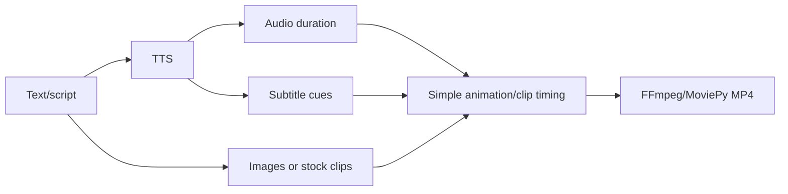

# Level 1: Simple Video

## Real reference path

The closest implemented path is MoneyPrinter's stock-video generator (`references/MoneyPrinter/Backend/pipeline.py:73-179`; `video.py:162-345`) and MoneyPrinterTurbo's configurable equivalent (`app/services/task.py:1315-1444`).

## Capability status

| Step | Exists in references | Evidence |
|---|---|---|
| Text input | ✅ | MoneyPrinter `pipeline.py:50-79` |
| TTS | ✅ | MoneyPrinter `pipeline.py:123-142`; MoneyPrinterTurbo `task.py:1354-1361` |
| Images/stock clips | ✅ for stock clips | MoneyPrinter `pipeline.py:90-118`; Turbo `material.py:296-605` |
| Simple animation/cropping | ✅ | MoneyPrinter `video.py:193-250`; Turbo `video.py:538-762` |
| Subtitle | ✅ | MoneyPrinter `video.py:118-159`; Turbo `task.py:1380-1392` |
| Final MP4 | ✅ | MoneyPrinter `video.py:268-345` |
| Generated still images | ❌ as an integrated path | No image provider in MoneyPrinter; Turbo primarily consumes materials |
| Word-level subtitles | ⚠️ | TTS boundary support exists in Edge/Turbo, but MoneyPrinter local path is sentence-level |

## Simplest future build

Start from MoneyPrinter's DB job/API shape but use a typed script/scene/timeline manifest. Add per-job directories and stage artifacts before adding generative images. This level should run fully locally with Ollama + local TTS/whisperX + FFmpeg, while stock download remains optional.
