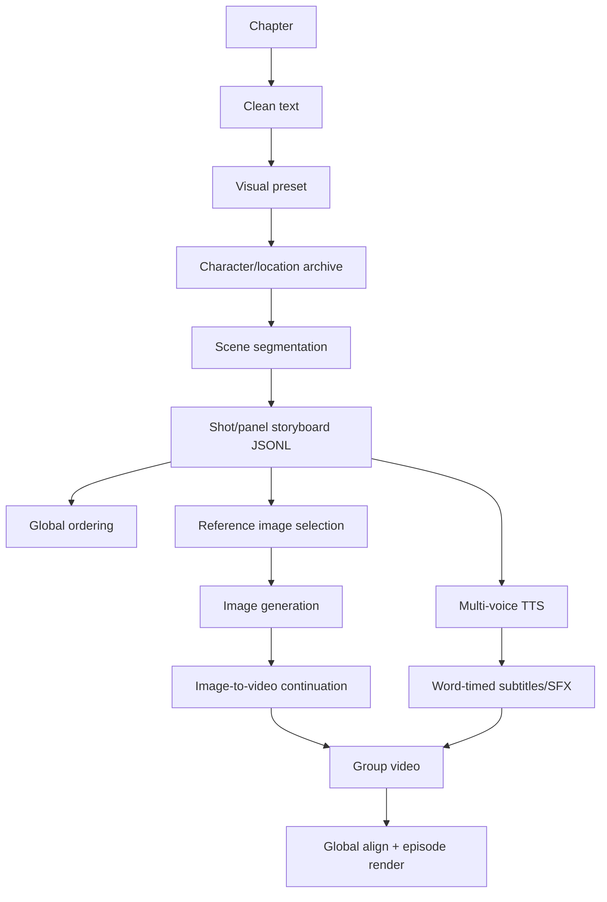

# Level 3: Story Video

## Real reference path

story-claw is the only reference implementing a complete story/novel episode path. Its stages are in `references/story-claw/runner/solo.ts:60-277`; planning is in `runner/pipeline.ts:493-1024`; rendering is in `runner/render.ts:1416-1695`.

## Capability status

| Step | Exists | Evidence / limitation |
|---|---|---|
| Story analysis | ✅ partial | story-claw visual/archive agents; no full novel knowledge graph |
| Character/location context | ✅ | `pipeline.ts:556-696`; persistent workspace assets |
| Scene split | ✅ | `pipeline.ts:760-793` |
| Shot planning | ✅ | `pipeline.ts:810-1024` |
| Reference images | ✅ | `render.ts:338-591,1518-1538` |
| Image generation | ✅ | `render.ts:612-678` |
| Image-to-video | ✅ | `render.ts:687-794` ComfyUI/LTX |
| Multiple voices | ✅ | `render.ts:1017-1160` |
| Word subtitles/SFX | ✅ | `render.ts:1092-1233` |
| Durable scene timeline | ⚠️ | JSONL/files/global order, not a general database IR |
| Quality evaluator/regeneration loop | ❌ | File/duration checks and retries only |
| Character/style drift scoring | ❌ | No automated visual evaluator |
| Novel-wide memory | ❌ | selective prior/later reads only |

## Design implication

Adopt story-claw's staged artifacts and panel contract as the first story milestone. Before adding long novels, replace prompt-only context with a versioned story memory and typed scene graph; otherwise re-running one chapter can silently drift from earlier character/location decisions.
