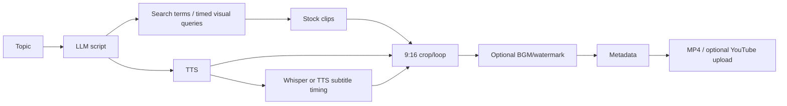

# Level 2: YouTube Short

## Real reference paths

MoneyPrinter implements subject → Ollama script/search terms → Pexels → TTS → subtitles → vertical composition → metadata/upload (`references/MoneyPrinter/Backend/pipeline.py:50-234`, `video.py:162-345`). ShortGPT implements the same shape with a resumable ten-step engine and timed Pexels queries (`ShortGPT/shortGPT/engine/content_video_engine.py:32-159`).

## Capability status

| Step | Exists in references | Evidence |
|---|---|---|
| Topic/script | ✅ | MoneyPrinter `gpt.py:142-234`; ShortGPT content engines |
| Scene/time-range planning | ⚠️ | ShortGPT `getVideoSearchQueriesTimed` uses caption intervals, not story scenes |
| Stock search | ✅ | MoneyPrinter `search.py`; ShortGPT `api_utils/pexels_api.py` |
| Image/video generation | ❌/⚠️ | Turbo has optional generated video materials; no general image planner |
| TTS and subtitle | ✅ | Both pipelines |
| Music | ✅ | MoneyPrinter `pipeline.py:240-346`; ShortGPT editing steps |
| Job queue | ✅ in MoneyPrinter, ❌ in ShortGPT | MoneyPrinter `worker.py:35-76`; ShortGPT engine is synchronous |
| Resume | ❌ in MoneyPrinter, ✅ in ShortGPT | `abstract_content_engine.py:60-75` |
| YouTube metadata/upload | ✅ | MoneyPrinter `pipeline.py:181-232`; ShortGPT `content_video_engine.py:144-159` |

## Local/cheap route

Use Ollama or a local compatible LLM, Edge TTS/F5-TTS, local whisperX alignment, local BGM, and FFmpeg. Add cloud image/video only behind optional provider adapters. Preserve ShortGPT's timed visual-query idea but replace string pairs with scene/timeline records.
